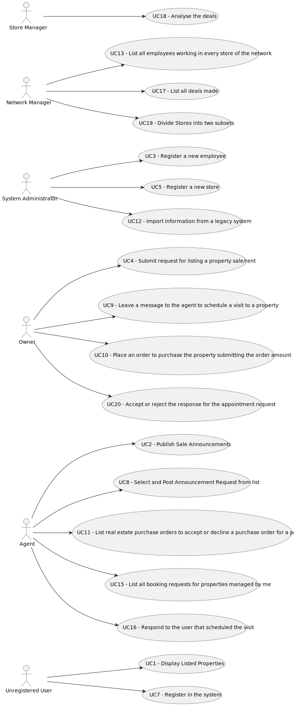

# Use Case Diagram (UCD)

**In the scope of this project, there is a direct relationship of _1 to 1_ between Use Cases (UC) and User Stories (US).**

[//]: # (However, be aware, this is a pedagogical simplification. On further projects and curricular units might also exist _1 to)

[//]: # (N **and/or** N to 1 relationship between US and UC.)

[//]: # (**For each UC/US, it must be provided evidences of applying main activities of the software development process &#40;)

[//]: # (requirements, analysis, design, tests and code&#41;. Gather those evidences on a separate file for each UC/US and set up a)

[//]: # (link as suggested below.**)

# Use Cases / User Stories

| UC/US  | Description                                                                                                    |                   
|:-------|:---------------------------------------------------------------------------------------------------------------|
| US 001 | [Display Listed Properties](../../us001/Readme.md)                                                             |
| US 002 | [Publish Sale Announcement](../../us002/Readme.md)                                                             |
| US 003 | [Register a new employee](../../us003/Readme.md)                                                               |
| US 004 | [Submit request for listing a property sale/rent](../../us004/Readme.md)                                       |
| US 005 | [Register a new store](../../us005/Readme.md)                                                                  |
| US 007 | [Register user in the system](../../us007/Readme.md)                                                           |
| US 008 | [Select and Post Announcement Request from list](../../us008/Readme.md)                                        |
| US 009 | [Create a visit request to a property](../../us009/Readme.md)                        |
| US 010 | [Place an order to purchase the property submitting the order amount](../../us010/Readme.md)                   |
| US 011 | [List real estate purchase orders to accept or decline a purchase order for a property](../../us011/Readme.md) |
| US 012 | [Import information from a legacy system](../../us012/Readme.md)                                               |
| US 013 | [List all employees working in every store of the network](../../us013/Readme.md)                              |
| US 015 | [List all booking requests for properties managed by me](../../us015/Readme.md)                                |
| US 016 | [Respond to the user that scheduled the visit](../../us016/Readme.md)                                          |
| US 017 | [List all deals made](../../us017/Readme.md)                                                                   |
| US 018 | [Analyse the deals](../../us018/Readme.md)                                                                     |
| US 019 | [Divide Stores into two subsets](../../us019/Readme.md)                                                        |
| US 020 | [Accept or reject the response for the appointment request](../../us020/Readme.md)                              |
