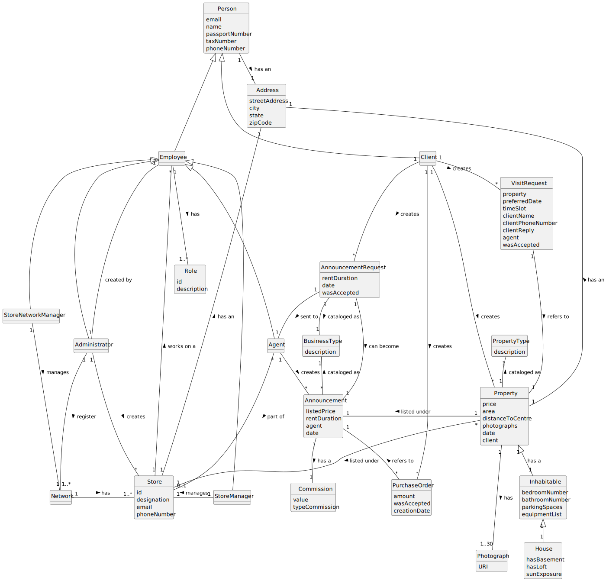

# Analysis

The construction process of the domain model is based on the client specifications, especially the nouns (for _concepts_) and verbs (for _relations_) used. 

## Rationale to identify domain conceptual classes ##
To identify domain conceptual classes, start by making a list of candidate conceptual classes inspired by the list of categories suggested in the book "Applying UML and Patterns: An Introduction to Object-Oriented Analysis and Design and Iterative Development". 

### _Conceptual Class Category List_ ###

**Business Transactions**

* Announcement
* AnnouncementRequest
* PurchaseOrder

---

**Transaction Line Items**

*

---

**Product/Service related to a Transaction or Transaction Line Item**

*  

---

**Transaction Records**

*  

---  

**Roles of People or Organizations**

* Administrator
* Employee
* Agent
* StoreManager
* Role
* Client
* StoreNetworkManager

---

**Places**

* Store
* Property
* House
* Inhabitable

---

**Noteworthy Events**

* VisitRequest 

---

**Physical Objects**

*

---

**Descriptions of Things**

* PropertyType
* BusinessType

---

**Catalogs**

* PropertyType
* BusinessType

**Containers**

*  

---

**Elements of Containers**

*  

---

**Organizations**

* Network

---

**Other External/Collaborating Systems**

---

**Records of finance, work, contracts, legal matters**

* 

---

**Financial Instruments**

*  

---

**Documents mentioned/used to perform some work/**

* 
---

**Rationale to identify associations between conceptual classes**

An association is a relationship between instances of objects that indicates a relevant connection and that is worth of remembering, or it is derivable from the List of Common Associations: 

+ **_A_** is physically or logically part of **_B_**
+ **_A_** is physically or logically contained in/on **_B_**
+ **_A_** is a description for **_B_**
+ **_A_** known/logged/recorded/reported/captured in **_B_**
+ **_A_** uses or manages or owns **_B_**
+ **_A_** is related with a transaction (item) of **_B_**
+ etc.

| Concept (A)         | Association         | Concept (B)       |
| ------------------- | ------------------- | ----------------- |
| Agent               | creates             | Announcement      |
| AnnouncementRequest | requires            | Agent             |
| AnnouncementRequest | requires            | Property          |
| AnnouncementRequest | cataloged as        | BusinessType      |
| AnnouncementRequest | can become          | Announcement      |
| Employee            | has                 | Role              |
| Administrator       | plays as            | Employee          |
| Agent               | plays as            | Employee          |
| StoreManager        | plays as            | Employee          |
| StoreNetworkManager | plays as            | Employee          |
| Store               | plays as            | Employee          |
| Administrator       | creates             | Store             |
| Administrator       | registers           | Network           |
| StoreManager        | manages             | Store             |
| Client              | creates             | Property          |
| Property            | cataloged as        | PropertyType      |
| Property            | listed under        | Store             |
| House               | is a                | Inhabitable       |
| Inhabitable         | is a                | Property          |
| StoreNetworkManager | manages             | Network           |
| Network             | has                 | Store             |
| Property            | has an              | Address           |
| Employee            | has an              | Address           |
| Client              | has an              | Address           |
| Store               | has an              | Address           |
| Client              | creates             | VisitRequest      |
| VisitRequest        | refers to           | Property          |
| Announcement        | cataloged as        | BusinessType      |
| Announcement        | listed under        | Property          |
| Announcement        | refers to           | PurchaseOrder     |
| Employee            | works on a          | Store             |
| AnnouncementRequest | sent to             | Agent             |
| Agent               | part of             | Store             |
| Client              | creates             | AnnouncementRequest |
| Property            | has                 | Photograph        |
| Client              | creates             | VisitRequest      |
| Person              | has an              | Address           |
| Client              | creates             | PurchaseOrder     |
| Agent               | creates             | Announcement      |

## Domain Model

