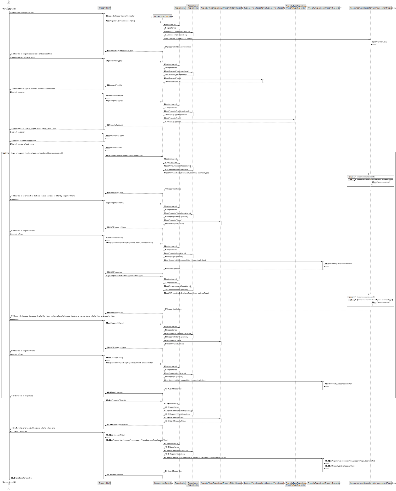
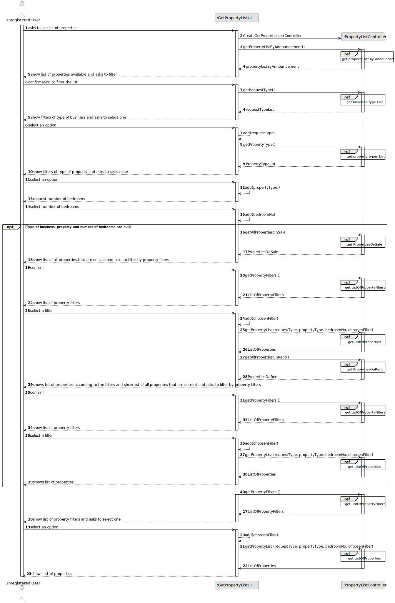
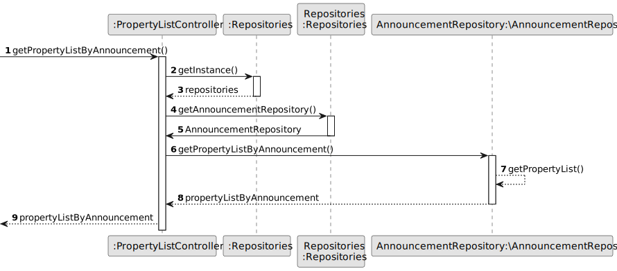
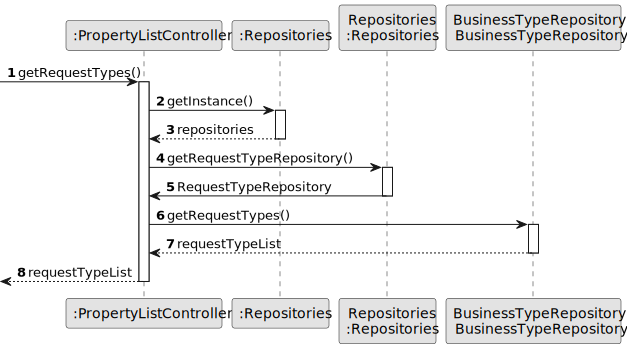
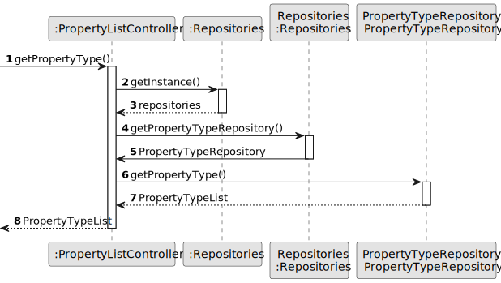
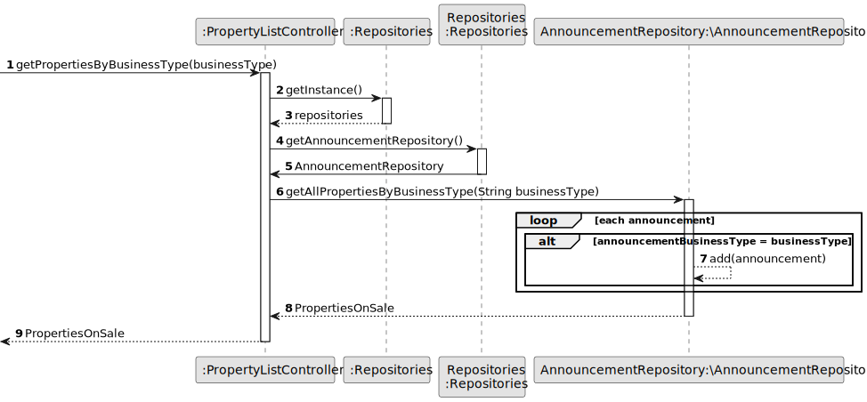
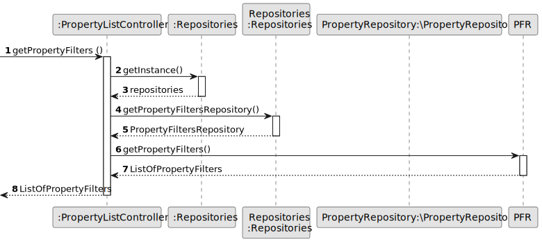
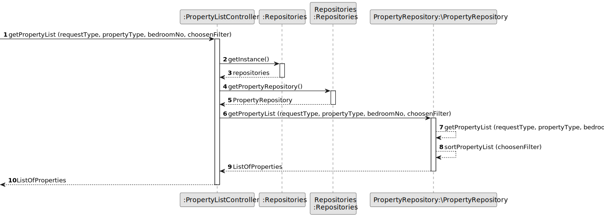
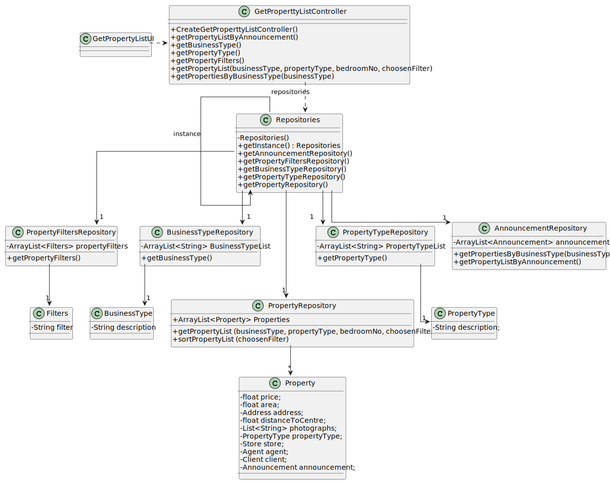

# US 001 - Display listed properties

## 3. Design - User Story Realization 

### 3.1. Rationale

**SSD - Display listed properties**

| Interaction ID                                                                                 | Question: Which class is responsible for...                | Answer                    | Justification (with patterns)                                                                                 |
|:-----------------------------------------------------------------------------------------------|:-----------------------------------------------------------|:--------------------------|:--------------------------------------------------------------------------------------------------------------|
| Step 1 -  asks to see list of properties		                                                     | 	... interacting with the actor?                           | PropertyListUI            | Pure Fabrication: there is no reason to assign this responsibility to any existing class in the Domain Model. |
| 			  		                                                                                        | 	... coordinating the US?                                  | PropertyListController    | Controller                                                                                                    |
| Step 2 - show filters of type of business and asks to select one                               | 		... knowing the filters of type of business to show?	  	 | RequestTypeRepository     | Repository                                                                                                    |
| Step 3 - selects an option       		                                                            | 	...saving the choosen option of type of business?         | PropertyListUI            | Pure Fabrication                                                                                              |
| Step 4 -  show filters of type of property and asks to select one                              | 		... knowing the filters of type of property to show?	  	 | PropertyTypeRepository    | Repository                                                                                                    |
 | Step 5 - selects an option     		                                                              | 	...saving the choosen option of type of business?         | PropertyListUI            | Pure Fabrication                                                                                              |
| Step 6 - request number of bedrooms                                                            | ... showing the number of bedrooms                         | PropertyListController    | Controller                                                                                                    |
| Step 7 - select number of bedrooms			  		                                                      | 	... saving the insered number of bedrooms?                | PropertyListUI            | Pure Fabrication                                                                                              | 
| Step 9 -   show list of all properties that are on sale and asks to filter by property filters | 	... knowing the property filters to show?                 | AnnouncementRepository    | Repository                                                                                                    |
| Step 9 -   show list of all properties that are on rent and asks to filter by property filters | 	... knowing the property filters to show?                 | AnnouncementRepository | Repository                                                                                                    |
 | Step 10 -  show list of property filters and asks to select one                                | 	... knowing the property filters to show?                 | PropertyFiltersRepository | Repository                                                                                                    |
| Step 11 - select an option		                                                                   | 	... saving the choosen property filter?                   | PropertyListUI            | Pure Fabrication                                                                                              | 
| 			  		                                                                                        | 	... saving the created list?                              | PropertyRepository        | IE: knows all properties                                                                                      |
| Step 12 -  shows list of properties                                                            | 	... informing operation success?                          | PropertyListUI            | It is responsible for user interactions.                                                                      |
|                                                                                                | ... knowing the list of properties to show                 | PropertyRepository        | Repository                                                                                                    |

### Systematization ##

According to the taken rationale, the conceptual classes promoted to software classes are:

 * PropertyTypeRepository 
 * RequestTypeRepository
 * PropertyFiltersRepository
 * AnnouncementRepository

Other software classes (i.e. Pure Fabrication) identified:
 * PropertyListUI
 * PropertiesListController

## 3.2. Sequence Diagram (SD)

### Alternative 1 - Full Diagram

This diagram shows the full sequence of interactions between the classes involved in the realization of this user story.

### Alternative 2 - Split Diagram

This diagram shows the same sequence of interactions between the classes involved in the realization of this user story, but it is split in partial diagrams to better illustrate the interactions between the classes.

It uses interaction ocurrence.

**Get Property List By Announcement**

**Get Business Type List**

**Get Property Types List**

**Get Property Listed on Sale**

**Get Property Listed on Rent**

**Get Property Filters List**

**Get Property List**

## 3.3. Class Diagram (CD)

