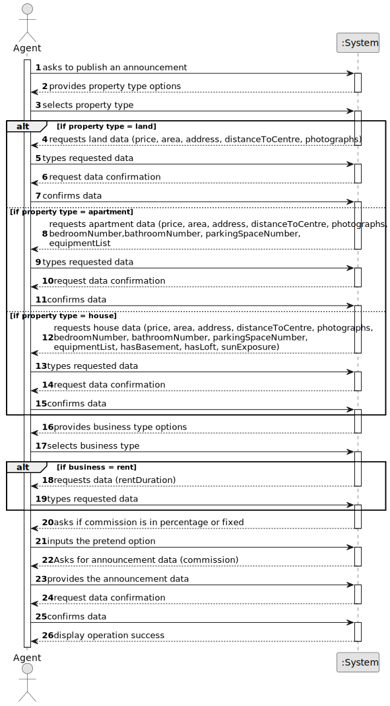

# US 002 - Publish any sale announcement

## 1. Requirements Engineering

### 1.1. User Story Description

As an agent, I can publish any sale announcement on the system, for
example received through a phone call.

### 1.2. Customer Specifications and Clarifications 

**From the specifications document:**

>	The real estate agent reviews advertisement requests, registers the information in the system and
publishes the offer so that it is visible to all clients who visit the agency and use the application.

**From the client clarifications:**

> **Question:** What would be the attributes of the Owner and Agent?
>  
> **Answer:** The Owner attributes are: the name, the citizen's card number, the tax number, the address, the email address and the contact
telephone number. The Agent is an employee of the company.

> **Question:** Is the phone call the only way the agent can receive the sale announcement? Or he can receive them via e-mail/letter/etc
>  
> **Answer:**  For now this is the only way.

 > **Question:** The act of publishing a sale announcement means that the agent is publishing a new property for sale in the system (receiving the information of the seller and publishing the new property for sale) or is it the buyer giving positive feedback to the agent with intent to buy the property(actually closing a sale, buying a property and de-listing said property) ?
>
>**Answer:** In US1 we get "As an agent, I can publish any sale announcement on the system, for example received through a phone call". Additional information related with this question is also avaliable in the project description. Asking the customer something that is clear or has already been clarified is unprofessional.
 

>**Question:** When the agent receives the phone call (as mentioned in US002) is it the agent who registers the order in the system or has the order already been entered into the system by the owner? Or is the phone call just for the owner to tell the agent that he registered a request in the system?
> 
> **Answer:** The agent registers the order in the system.

> **Question:** Are there only 2 types of commission or can the Administrator define more types of commission?
> 
> **Answer:** For now we only have two types of commissions.

> **Question:** Will we need to implement Java FX for this US, despite it already being built for console?
> 
> **Answer:** US2 is a US from Sprint A. Therefore you do not need to implement a Graphical User Interface (GUI) for this US. The GUI requirement is only for USs introduced in Sprint D.

> **Question:** In the Acceptance Criteria number 2 of the new refinement to the US002, it is stated that "The notification must include the property identification...". Is this property identification the address of said property or something else?
> 
> **Answer:** Yes, the identification is the property address.

> **Question:** Are the SMSs created the same way as the emails? The emails are made through a text file, are the SMS notifications the same way?
> 
> **Answer:** A file named SMS.txt should be used

> **Question:** Which number should be used to send the SMS, the responsible agent's number or the agency where the agent works?
> 
> **Answer:** The responsible agent phone number.

> **Question:** Regarding US002, the client previously stated that if the announcement is made through a phone call between the Owner and the agent, the Owner´s information wasn't needed, and therefore it wasn't recorded in the system. My question is whether this decision still applies even with the introduction of US007 (client/user registration)?
> 
> **Answer:**  I already clarified this point: "The agent should identify, in the system, the owner that wants to sell a property. The agent should use the owner e-mail address to identify the owner. The owner who is contacting the agent (for example, through a phone call) must be registered in the system. The agent that receives the phone call is the property responsible agent."

> **Question:** In US002, does the agent only register the request in the system that he receives from the owner in a phone call, or can he (the agent) also accept/reject requests that the owner registers in the system (without a phone call)?
> 
> **Answer:** The agent only publishes the sale announcement that he receives from the owner in a phone call.  The agent that receives the phone call is the property responsible agent.
> 
> **Question:** In one of the previous questions you have stated that for now the only way that an agent can receive the sale announcement request is through a phone call. However, US004 states that "As an owner, I intend to submit a request for listing a property sale or rent, choosing the responsible agent". Isn't submitting a request for listing a property the same as a sale announcement request? If not, can you clarify?
> 
> **Answer:**  In my previous answer, when I said "...the only way that an agent can receive the sale announcement..." I was talking about the agent as an actor of the system that introduces in the system property data.

>**Question:** Also, since the only way that an agent can receive sale announcement request is through a phone call, wouldn't that contradict what was stated in the project description: "Owners go to one of the company's branches and meet with a real estate agent to sell or rent one or more properties, or they can use the company's application for the same purposes."?
> 
> **Answer:** US2: As an agent, I can publish any sale announcement on the system, for example received through a phone call. For example...

### 1.3. Acceptance Criteria

* **AC1:** All required fiels must be filled in.
* **AC2:** When creating an announcement  with an already existing reference, the system must reject such operation and the user must have the change to modify the typed reference.

### 1.4. Found out Dependencies

* There a dependency to "US004- Submit request for listing a property sale/rent" because the agent needs to accept the owner's request.

### 1.5 Input and Output Data

**Input Data:**

* Typed data:
	* price
	* area
	* address
	* distance to a city centre
	* Business Type-dependend Data:
		* rent duration
	* Property Type-dependent Data:
		* number of bedrooms
		* number of bathrooms
		* number of parking spaces
		* existence of equipment
		* existence of a basement
		* existence of an inhabitable loft
		* sun exposure
* Selected data:
	* business type
	* property type

**Output Data:**

* (In)Success of the operation

### 1.6. System Sequence Diagram (SSD)

**Other alternatives might exist.**

### 1.7 Other Relevant Remarks

* The created task stays in a "not published" state in order to distinguish from "published" tasks.