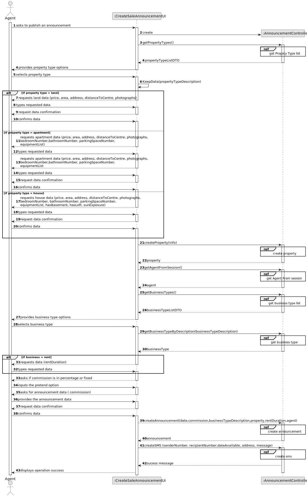

# US 002 - Publish any sale announcement

## 3. Design - User Story Realization 

### 3.1. Rationale

**SSD - Alternative 1 is adopted.**

| Interaction ID                                  | Question: Which class is responsible for...            | Answer                   | Justification (with patterns)                                                                                 |
|:------------------------------------------------|:-------------------------------------------------------|:-------------------------|:--------------------------------------------------------------------------------------------------------------|
| Step 1 - asks to publish a sale announcement 		 | 	...interacting with the actor?                        | CreateSaleAnnouncementUI | Pure Fabrication: there is no reason to assign this responsibility to any existing class in the Domain Model. |
| 		                                              | 	...coordinating the US?                               | AnnouncementController   | Controller                                                                                                    |
| Step 2 - provides property type options         | 	...knowing the Property Types to show?                | PropertyTypeRepository   | Repository                                                                                                    |
| Step 3 - selects property type                  |                                                        |                          |                                                                                                               |                                              | 	...knowing the Stores to show?                        | StoreRepository                  | Repository                                                                                                    |                                       |                                                        |                                  |                                                                                                               |
| Step 4 - requests land data                     | ...requests land data?                                 | CreateSaleAnnouncementUI | Pure Fabrication: there is no reason to assign this responsibility to any existing class in the Domain Model. |      
|                                                 |                                                |                                                |                                                |                                                |
| Step 5 - types requested data                   | ...instantiating a new Land?                           | PropertyMapper           | Creator (Rule 1): in the DM Lands, a type of Property, are listed under a Agent.                              |
| 		                                              | 	 ...saving the inputted Land data?                    | Land                     | IE: The object created in here has its own data.                                                              |
|                                                 | 	...saving the selected Land Type?                     | Land                     | IE: The object created in here is classified as one type of property.                                         |
|                                                 | 	...saving the selected Store?                         | Land                     | IE: The object created in here is listed under a store.                                                       |
|                                                 | 	...validating all Land data (local validation)?       | Land                     | The Land owns its data.                                                                                       | 
| 		                                              | 	...validating all Land data (global validation)?      | PropertyRepository       | Repository                                                                                                    | 
| 		                                              | 	...saving the created Land?                           | PropertyRepository       | Repository                                                                                                    | 
| Step 6 - requests apartment data                | ... requests apartment data?                           | CreateSaleAnnouncementUI | Pure Fabrication: there is no reason to assign this responsibility to any existing class in the Domain Model. |                                                                                                      |
| Step 7 - types requested data                   | ...instantiating a new Apartment?                      | PropertyMapper           | Creator (Rule 1): in the DM Apartments, a type of Property, are listed under a Agent.                         |
| 		                                              | 	 ...saving the inputted Apartment data?               | Apartment                | IE: The object created in here has its own data.                                                              |
|                                                 | 	...saving the selected Apartment Type?                | Apartment                | IE: The object created in here is classified as one type of property.                                         |
|                                                 | 	...saving the selected Store?                         | Apartment                | IE: The object created in here is listed under a store.                                                       |
|                                                 | 	...validating all Apartment data (local validation)?  | Apartment                | The Apartment owns its data.                                                                                  | 
| 		                                              | 	...validating all Apartment data (global validation)? | PropertyRepository       | Repository                                                                                                    | 
| 		                                              | 	...saving the created Apartment?                      | PropertyRepository       | Repository                                                                                                    | 
| Step 8 - requests house data                    | ... requests house data?                               | CreateSaleAnnouncementUI | Pure Fabrication: there is no reason to assign this responsibility to any existing class in the Domain Model. |
| Step 9 - types requested data                   | ...instantiating a new House?                          | Property Mapper          | Creator (Rule 1): in the DM Houses, a type of Property, are listed under a Agent.                             |
| 		                                              | 	 ...saving the inputted House data?                   | House                    | IE: The object created in here has its own data.                                                              |
|                                                 | 	...saving the selected House Type?                    | House                    | IE: The object created in here is classified as one type of property.                                         |
|                                                 | 	...saving the selected Store?                         | House                    | IE: The object created in here is listed under a store.                                                       |
|                                                 | 	...validating all House data (local validation)?      | House                    | The House owns its data.                                                                                      | 
| 		                                              | 	...validating all House data (global validation)?     | PropertyRepository       | Repository                                                                                                    | 
| 		                                              | 	...saving the created House?                          | PropertyRepository       | Repository                                                                                                    | 
| Step 10 - provides business type options        | 	...knowing the Business Types to show?                | BusinessTypeRepository   | Repository                                                                                                    |
| Step 11 - select business type                  | ...  saving the business type?                         | CreateSaleAnnouncementUI | Pure Fabrication: there is no reason to assign this responsibility to any existing class in the Domain Model. |
| Step 12 - requests data                         |                                                        |                          |                                                                                                               |
| Step 13 - types requested data                  | 	...instantiating a new Announcement?                  | Announcement Mapper      | Creator (Rule 4): the Property uses the Announcement.                                                         |
|                                                 | ...saving the inputted Announcement data?              | Announcement             | IE: The object created in here has its own data.                                                              |
| 	                                               | ...saving the selected Business Type?                  | Announcement             | IE: The object created in here is classified as one type of request.                                          |
| 		                                              | 	...validating all Announcement data?                  | AnnouncementRepository   | The Announcement Repository owns its data.                                                                    | 
| 	                                               | 	...saving the created Announcement                    | AnnouncementRepository                    | Repository                                                                                                    | 
| 	Step 14 - displays operation success           | 	...informing operation success?                       | CreateSaleAnnouncementUI | It is responsible for user interactions.                                                                      |

### Systematization ##

According to the taken rationale, the conceptual classes promoted to software classes are: 

* Property
* Announcement
* House
* Apartment
* Land

Other software classes (i.e. Pure Fabrication) identified: 

 *  CreateSaleAnnouncementUI
 * AnnouncementController

## 3.2. Sequence Diagram (SD)

[//]: # (### Alternative 1 - Full Diagram)

[//]: # ()
[//]: # (This diagram shows the full sequence of interactions between the classes involved in the realization of this user story.)

[//]: # ()
[//]: # (![Sequence Diagram - Full]&#40;svg/us002-sequence-diagram-full.svg&#41;)

### Split Diagram

This diagram shows the same sequence of interactions between the classes involved in the realization of this user story, but it is split in partial diagrams to better illustrate the interactions between the classes.

It uses interaction ocurrence.

**Get Property Type List**

**Get Property Type Object**

**Create Land Object**

**Create Apartment Object**

**Create House Object**

**Get Request Type List Partial SD**

**Get Request Type Object**

**Create Announcement (Rent)**

**Create Announcement (Sale)**

**Create Sms **

**Get Agent from Session**

## 3.3. Class Diagram (CD)

