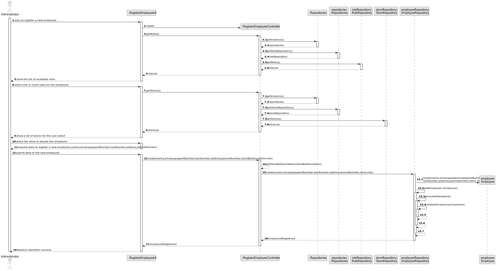
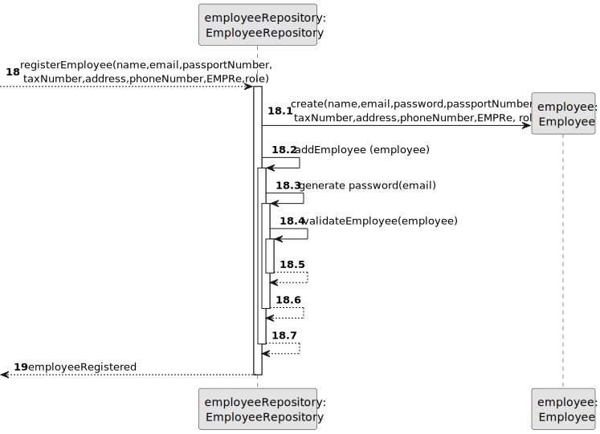

# US 003 - Register a new employee

## 3. Design - User Story Realization 

### 3.1. Rationale

**SSD - Alternative 1 is adopted.**

| Interaction ID                                     | Question: Which class is responsible for...                   | Answer                     | Justification (with patterns)                                                                                 |
|:---------------------------------------------------|:--------------------------------------------------------------|:---------------------------|:--------------------------------------------------------------------------------------------------------------|
| Step 1 - asks to register a new employee           | 	... interacting with the actor?                              | RegisterEmployeeUI         | Pure Fabrication: there is no reason to assign this responsibility to any existing class in the Domain Model. |
|                                                    | 	... coordinating the US?                                     | RegisterEmployeeController | Controller                                                                                                    |
|                                                    | 	... instantiating a new Employee?                            | EmployeeRepository             | Creator (Rule 1): in the DM Store has one or more employees.                                                  |
| Step 2  - show the list of available roles         | ...knowing the employee roles to show?                        | RoleRepository             | Repository                                                                                                    |
| Step 3 - select one or more roles for the employee |                                                               |                            |                                                                                                               |
| Step 4 - show a list of stores for the user select | 	...knowing the store to show?                                | StoreRepository            | Repository                                                                                                    | 
| Step 5 - select the store to situate the employee  |                                                               |                            |                                                                                                               |
| Step 6 -	 request data to register a new employee  |                                                               |                            |                                                                                                               |
| Step 7 - submit data of the new employee           | 	... saving the selected roles?                               | Employee                   | IE: object created in step 1 associated with at least one role                                                | 
|                                                    | 		                            ... saving the selected stores? | Employee                   | IE:object created in step 1 associated with at least one store                                                |
|                                                    | 	... saving the created employee?                             | EmployeeRepository                      | Repository                                                                                                    | 
| Step 8 - displays operation sucess                 | 	... informing operation success?                             | RegisterEmployeeUI         | IE: is responsible for user interactions.                                                                     | 

### Systematization ##

According to the taken rationale, the conceptual classes promoted to software classes are: 

 * Employee
 * Store

Other software classes (i.e. Pure Fabrication) identified: 

* RegisterEmployeeUI
* RegisterEmployeeController
* StoreRepository
* RoleRepository
* EmployeeRepository

## 3.2. Sequence Diagram (SD)

### Alternative 1 - Full Diagram

This diagram shows the full sequence of interactions between the classes involved in the realization of this user story.

### Alternative 2 - Split Diagram

This diagram shows the same sequence of interactions between the classes involved in the realization of this user story, but it is split in partial diagrams to better illustrate the interactions between the classes.

It uses interaction ocurrence.

**Get Roles List Partial SD**

**Get Stores List**

**Get Role**

**Get Store**

**Register Employee**

## 3.3. Class Diagram (CD)

