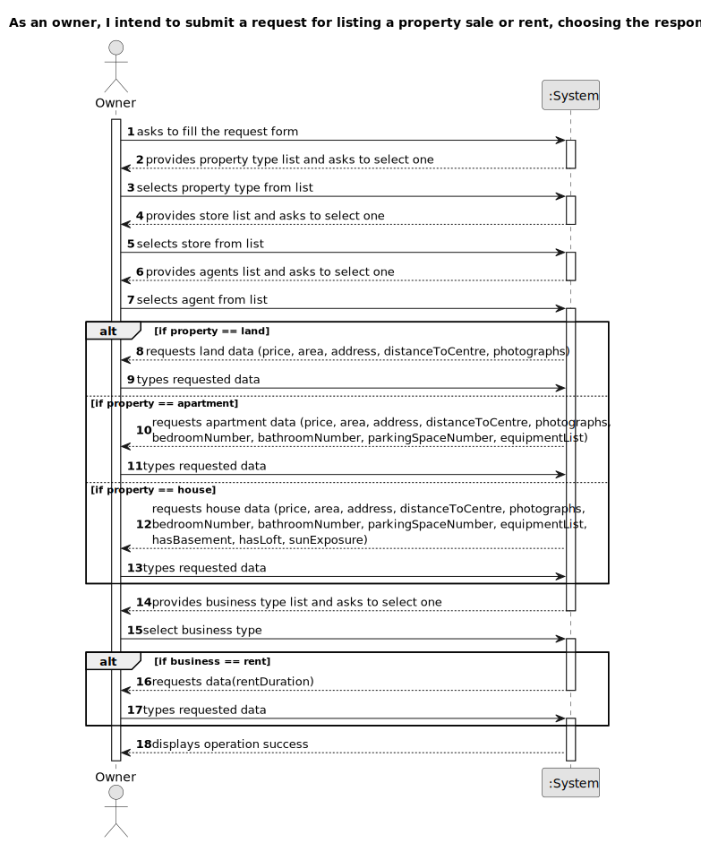

# US 004 - Submit request for listing a property sale/rent

## 1. Requirements Engineering

### 1.1. User Story Description

As an owner, I intend to submit a request for listing a property sale or rent, choosing the responsible agent.

### 1.2. Customer Specifications and Clarifications 

**From the specifications document:**

>	The owner provides property characteristics and the requested price and sends the request to an agent.

>	In the case of a request for the sale of a property, the owner must provide information on: the type of property (apartment, house or land), the area in m2, the location, the distance from the city centre, the requested price and one or more photographs. If the property is an apartment or a house, the owner also provides: the number of bedrooms, the number of bathrooms, the number of parking spaces and the available equipment, such as central heating and/or air conditioning. In case the property is a house, the existence of a basement, an inhabitable loft, and sun exposure must be registered as well.

**From the client clarifications:**

> **Question:** We are having a little issue defining what the sun exposure might be. We are not sure what it will be as a value. If it's a number that defines how much exposure the house has or if it is just a text saying if it has or hasn't sun exposure.
>  
> **Answer:** Sun exposure will take the following values: North, South, East, or West.

> **Question:** In the Project description, there are only specifications for a Sale. What are the required characteristics for a rental?
>  
> **Answer:** The caracteristics for a rental are the same as the ones for the sale of a property. The rent value is per month. Additionally, we have to define the contract duration.

> **Question:** Are there any restrictions on the choice of an Agent?
>
> **Answer:** No.

> **Question:** In case the submission of the listing is online may the owner choose any agent?
>
> **Answer:** Yes.

> **Question:** In case it is on an agency, must the agent be assigned automatically by the system?
>
> **Answer:** The agent that registers the information in the system can choose to assign any agent.

> **Question:** Is it possible to submit multiple listing for the same property and type of listing? 
> 
> **Answer:** No.

> **Question:** Does an owner need to be registered in the system to submit a request for a property listing?
>
> **Answer:** No. When making the request to list a property, the owner should introduce his own data. The Owner attributes are: the name, the citizen's card number, the tax number, the address, the email address and the telephone number.

> **Question:** When assigning an agent to a property listing, are the available agents shown by the system for the owner to pick? Or does the owner need to provide the agent's information (name, agency,etc)?
> 
> **Answer:** The owner should select one agent from a list of agents that work in the selected agency. The owner should select the agency before selecting the agent.

> **Question:** Is there a designated currency for this business, or should we use USD?
> 
> **Answer:** Please use USD.

> **Question:** It was previously stated that an unregistered user could do a property listing request. However, with the introduction of US007, I want to clarify and make sure that now a user needs to be registered in order to buy, sell or rent properties, or if they can still do it unregistered.
> 
> **Answer:** In Sprint B we introduce US7 and now, in US4, the owner needs to be registered in the system to submit a request for listing. You should update all artifacts to include this change.

> **Question:** According to the the statement, the administrator has to clarify the citizen's card number, but what card is it? In the US, there is no identification card, so is it referring to the passport?
>
> **Answer:** You are correct. The citizen card number should be replaced by the passport card number.

> **Question:** What should we use to distinguish property requests made by the owner, the location of said property?
>
> **Answer:** Each request is a single order.

> **Question:** When the owner is going to make the request for listing a property for sale or rent, is he (owner) already registered in the system? If yes, before placing the order, does he need to enter any of his data, for example, email address?
> 
> **Answer:** Yes. The data is available in the system.

> **Question:** Can the contract duration be defined as double or float, for example, 1.5 months?
> 
> **Answer:** The contract duration is an integer number.

> **Question:** In the project description it is mentioned that in the case of a request for the sale of a property, the owner must provide "one or more photographs". Taking that into account, is there a maximum number of photos that can be submitted when publishing an announcement? If so, how many?
> 
> **Answer:** The maximum number of photos is 30.

> **Question:** It was previously stated that an unregistered user could do a property listing request. However, with the introduction of US007, I want to clarify and make sure that now a user needs to be registered in order to buy, sell or rent properties, or if they can still do it unregistered.
> 
> **Answer:** In Sprint B we introduce US7 and now, in US4, the owner needs to be registered in the system to submit a request for listing. You should update all artifacts to include this change.

### 1.3. Acceptance Criteria

* **AC1:** All required fields must be filled in.
* **AC2:** When creating a listing for a property that already has one, the system must reject it.

### 1.4. Found out Dependencies

* There is a dependency to "US003 Register a new employee " since at least one employee of the type 'agent' must exist in order to be selected.
* There is a dependency to "US007 Register in the system" since the client needs to be registered in the system to submit a request.

### 1.5 Input and Output Data

**Input Data:**

* Typed data:
    * price 
    * area
    * address
    * distance to a city centre
    * Business Type-dependend Data:
      * rent duration
      * rent price
    * Property Type-dependent Data:
      * number of bedrooms
      * number of bathrooms
      * number of parking spaces
      * existence of equipment
      * existence of a basement
      * existence of an inhabitable loft
      * sun exposure
	
* Selected data:
	* business type
    * associated store
    * associated agent
    * property type

**Output Data:**

* (In)Success of the operation

### 1.6. System Sequence Diagram (SSD)

**Other alternatives might exist.**

### 1.7 Other Relevant Remarks

* n/a