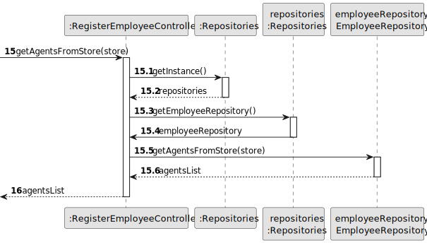
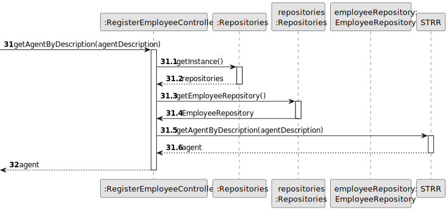

# US 004 - Submit request for listing a property sale/rent

## 3. Design - User Story Realization 

### 3.1. Rationale

**SSD - Alternative 1 is adopted.**

| Interaction ID                                                    | Question: Which class is responsible for...            | Answer                   | Justification (with patterns)                                                                                 |
|:------------------------------------------------------------------|:-------------------------------------------------------|:-------------------------|:--------------------------------------------------------------------------------------------------------------|
| Step 1 - asks to fill the request form  		                        | 	...interacting with the actor?                        | CreatePropertyUI         | Pure Fabrication: there is no reason to assign this responsibility to any existing class in the Domain Model. |
| 		                                                                | 	...coordinating the US?                               | CreatePropertyController | Controller                                                                                                    |
| Step 2 - provides property type list and asks to select one       | 	...knowing the Property Types to show?                | PropertyTypeRepository   | Repository                                                                                                    |
| Step 3 - selects property type from list                          |                                                        |                          |                                                                                                               |
| Step 4 - provides store list and asks to select one               | 	...knowing the Stores to show?                        | StoreRepository          | Repository                                                                                                    |
| Step 5 - selects store from list                                  |                                                        |                          |                                                                                                               |
| Step 6 - provides agents list from store and asks to select one   | 	...knowing the Agents to show?                        | EmployeeRepository       | Repository                                                                                                    |
| Step 7 - selects agent from list                                  |                                                        |                          |
| Step 8 - requests land data                                       |                                                        |                          |                                                                                                               |
| Step 9 - types requested data                                     | ...instantiating a new Land?                           | Store                    | Creator (Rule 1): in the DM Lands, a type of Property, are listed under a Store.                              |
| 		                                                                | 	 ...saving the inputted Land data?                    | Land                     | IE: The object created in here has its own data.                                                              |
|                                                                   | 	...saving the selected Land Type?                     | Land                     | IE: The object created in here is classified as one type of property.                                         |
|                                                                   | 	...saving the selected Store?                         | Land                     | IE: The object created in here is listed under a store.                                                       |
|                                                                   | 	...validating all Land data (local validation)?       | Land                     | The Land owns its data.                                                                                       | 
| 		                                                                | 	...validating all Land data (global validation)?      | Store                    | The Store knows all the properties under it.                                                                  | 
| 		                                                                | 	...saving the created Land?                           | Store                    | The Store manages all properties under it.                                                                    | 
| Step 10 - requests apartment data                                 |                                                        |                          |                                                                                                               |
| Step 11 - types requested data                                    | ...instantiating a new Apartment?                      | Store                    | Creator (Rule 1): in the DM Apartments, a type of Property, are listed under a Store.                         |
| 		                                                                | 	 ...saving the inputted Apartment data?               | Apartment                | IE: The object created in here has its own data.                                                              |
|                                                                   | 	...saving the selected Apartment Type?                | Apartment                | IE: The object created in here is classified as one type of property.                                         |
|                                                                   | 	...saving the selected Store?                         | Apartment                | IE: The object created in here is listed under a store.                                                       |
|                                                                   | 	...validating all Apartment data (local validation)?  | Apartment                | The Apartment owns its data.                                                                                  | 
| 		                                                                | 	...validating all Apartment data (global validation)? | Store                    | The Store knows all the properties under it.                                                                  | 
| 		                                                                | 	...saving the created Apartment?                      | Store                    | The Store manages all properties under it.                                                                    | 
| Step 12 - requests house data                                     |                                                        |                          |                                                                                                               |
| Step 13 - types requested data                                    | ...instantiating a new House?                          | Store                    | Creator (Rule 1): in the DM Houses, a type of Property, are listed under a Store.                             |
| 		                                                                | 	 ...saving the inputted House data?                   | House                    | IE: The object created in here has its own data.                                                              |
|                                                                   | 	...saving the selected House Type?                    | House                    | IE: The object created in here is classified as one type of property.                                         |
|                                                                   | 	...saving the selected Store?                         | House                    | IE: The object created in here is listed under a store.                                                       |
|                                                                   | 	...validating all House data (local validation)?      | House                    | The House owns its data.                                                                                      | 
| 		                                                                | 	...validating all House data (global validation)?     | Store                    | The Store knows all the properties under it.                                                                  | 
| 		                                                                | 	...saving the created House?                          | Store                    | The Store manages all properties under it.                                                                    | 
| Step 14 - provides business type list and asks to select one      | 	...knowing the Business Types to show?                | BusinessTypeRepository   | Repository                                                                                                    |
| Step 15 - selects business type                                   |                                                        |                          |                                                                                                               |
| Step 16 - requests data                                           |                                                        |                          |                                                                                                               |
| Step 17 - types requested data                                    | 	...instantiating a new AnnouncementRequest?           | Store                    | Creator (Rule 4): the Property uses the AnnouncementRequest.                                                  |
|                                                                   | ...saving the inputted AnnouncementRequest data?       | AnnouncementRequest      | IE: The object created in here has its own data.                                                              |
| 	                                                                 | ...saving the selected Business Type?                  | AnnouncementRequest      | IE: The object created in here is classified as one type of request.                                          |
| 		                                                                | 	...validating all AnnouncementRequest data?           | AnnouncementRequest      | The AnnouncementRequest owns its data.                                                                        | 
| 	                                                                 | 	...saving the created AnnouncementRequest?            | Store                    | The AnnouncementRequest refers to the created Property                                                        | 
| 	Step 18 - displays operation success                             | 	...informing operation success?                       | CreatePropertyUI         | It is responsible for user interactions.                                                                      |

### Systematization ##

According to the taken rationale, the conceptual classes promoted to software classes are: 

 * Property
 * AnnouncementRequest
 * House
 * Apartment
 * Land

Other software classes identified: 

 * CreateTaskUI  
 * CreateTaskController
 * BusinessTypeRepository
 * EmployeeRepository
 * StoreRepository
 * PropertyTypeRepository

## 3.2. Sequence Diagram (SD)

### Alternative 1 - Full Diagram

This diagram shows the full sequence of interactions between the classes involved in the realization of this user story.

### Alternative 2 - Split Diagram

This diagram shows the same sequence of interactions between the classes involved in the realization of this user story, but it is split in partial diagrams to better illustrate the interactions between the classes.

It uses interaction ocurrence.

**Get Property Type List**

**Get Stores List**

**Get Store Object**

**Get Agents List**

**Get Property Type Object**

**Get Agent Object**

**Create Land Object**

**Create Apartment Object**

**Create House Object**

**Get Request Type List Partial SD**

**Get Request Type Object**

**Create Announcement Request (Rent)**

**Create Announcement Request (Sale)**

## 3.3. Class Diagram (CD)

