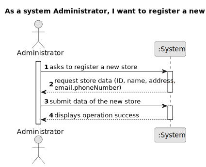

# US 005 - Register a new store 

## 1. Requirements Engineering

### 1.1. User Story Description

As a system administrator, I want to register a new store.

### 1.2. Customer Specifications and Clarifications 

**From the specifications document:**

> The company's systems administrator will be responsible for registering all stores and each store in the network has a store manager and the set of stores is managed by a store network manager.  The main functions of a store manager are to monitor and streamline the branch with the aim of getting to know better the business carried out and to analyse and evaluate the performance of employees.

**From the client clarifications:**

> **Question:** When a System Administrator (admin) makes a request to register a new employee or a new network branch (or any other alteration), does the System ask for the admin credentials (login, password)?
>
> **Answer:** The System Administrator should be logged in the application.

> **Question:**  Does a store designation have to be detailed? If so, will the system administrator have to register the name, email, phone number or anything else? Does the location of a store have to be detailed as well? If yes, will the system administrator have to record the address, postcode or something else? To register the store manager, does the system administrator only register the manager's name? If not, will the system administrator have to register the manager as if he were an employee (except the agent he is assigned to)?
>
> **Answer:** When registering a store, the System Administrator should introduce the following information: an ID, a designation/name, a location, a local manager, a phone number and an e-mail address. The ID is an integer number. An example of the store location is: 71 ST. NICHOLAS DRIVE, NORTH POLE, FAIRBANKS NORTH STAR, AK, 99705. An example phone number is (907) 488-6419.

> **Question:**  Could you please share how will the designation of new stores be made, is there a pattern perhaps?
> 
> **Answer:** There is no pattern. The System Administrator can introduce any designation/name. The designation/name should have at most forty characters.

> **Question:** Will the System Administrator be able to choose a location from a list of available locations (defined elsewhere in the application) or will he be able to submit any location he wants?
>
> **Answer:** The System Administrator can submit any location.

> **Question:** Are the local managers restricted to their initial location or can they be re-registered/reassigned to other locations?
>
> **Answer:** For now this is not a problem.

> **Question:** When a System Administrator (admin) makes a request to register a new employee or a new network branch (or any other alteration), does the System ask for the admin credentials (login, password)?
>
> **Answer:** The System Administrator should be logged in the application.

> **Question:** Is the store manager also an agent ?
>
> **Answer:** No.

> **Question:** The network manager is the system admin ?
>
> **Answer:** No.

> **Question:** There is only one manager for each store and only ONE system administrator ?
>
> **Answer:** Yes.

> **Question:** Is there only one network of stores?
>
> **Answer:** Yes.

> **Question:** While a store is being registered, does the system have to provide a list of states, districts and cities?
> 
> **Answer:** No.

### 1.3. Acceptance Criteria

* **AC1:** All required fiels must be filled in.
* **AC2:** The ID must be an integer number.
* **AC3:** The telephone number should have this format:(000) 000-0000.
* **AC4:** The designation must have at most 14 alphanumeric chars.
* **AC5:** When creating a store with an already existing reference, the system must reject such operation and the user must have the change to modify the typed reference.

### 1.4. Found out Dependencies

* There is no dependency

### 1.5 Input and Output Data

**Input Data:**

* Typed data:
	* an ID
    * the designation/name
    * the location
    * the email address
    * the contact telephone number

**Output Data:**

* (In)Success of the operation

### 1.6. System Sequence Diagram (SSD)

**Other alternatives might exist.**

### 1.7 Other Relevant Remarks

* n/a