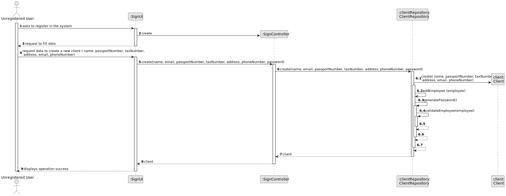
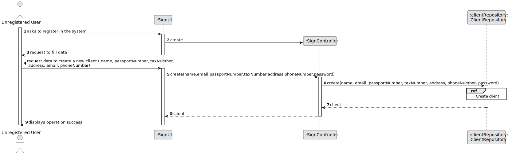

# US 007 - Register in the system 

## 3. Design - User Story Realization 

### 3.1. Rationale

**SSD - Alternative 1 is adopted.**

| Interaction ID                | Question: Which class is responsible for...   | Answer             | Justification (with patterns)                                                                                                 |
|:------------------------------|:----------------------------------------------|:-------------------|:------------------------------------------------------------------------------------------------------------------------------|
| Step 1 - asks to register     | ... interacting with the actor?                | SignUI             | Pure Fabrication: there is no reason to assign this responsibility to any existing class in the Domain Model.                 |
|                              | ... coordinating the US?                       | SignController     | Controller                                                                                                                    |
|                              | ... instantiating a new Client?                | ClientRepository   | Creator (Rule): The ClientRepository is responsible for creating and managing instances of the Client class.                  |
| Step 2 - request to fill data | ...saving the inputted data?                   | Client             | Entity: The Client class represents the client entity, and it owns the data inputted during the registration process.          |
|                              | ... validating all data (local validation)?    | Client             | Information Expert: The Client class has access to its own data and can perform local validation.                            |
|                              | ... validating all data (global validation)?   | ClientRepository   | Creator (Rule): The ClientRepository can perform global validation on the client data.                                      |
|                              | ... saving the created client?                  | ClientRepository   | Creator (Rule): The ClientRepository is responsible for persisting the client data.                                         |
| Step 3 - displays success    | ... informing operation success?               | SignUI             | Pure Fabrication: The SignUI is responsible for displaying information and interacting with the user.                          |

### Systematization ##

According to the taken rationale, the conceptual classes promoted to software classes are: 

 * Client

Other software classes (i.e. Pure Fabrication) identified: 

 * SignUI  
 * SignController
 * ClientRepository

## 3.2. Sequence Diagram (SD)

### Alternative 1 - Full Diagram

This diagram shows the full sequence of interactions between the classes involved in the realization of this user story.

### Alternative 2 - Split Diagram

This diagram shows the same sequence of interactions between the classes involved in the realization of this user story, but it is split in partial diagrams to better illustrate the interactions between the classes.

It uses interaction ocurrence.

**Create Client**

## 3.3. Class Diagram (CD)

