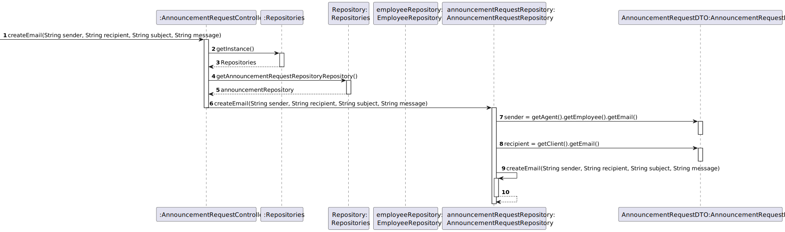

# US008 - Select and Post Announcement Request from list

## 3. Design - User Story Realization 

### 3.1. Rationale

**SSD - Alternative 1 is adopted.**

| Interaction ID                                                                                                                                             | Question: Which class is responsible for...                                                | Answer                        | Justification (with patterns)                                                                                 |
|:-----------------------------------------------------------------------------------------------------------------------------------------------------------|:-------------------------------------------------------------------------------------------|:------------------------------|:--------------------------------------------------------------------------------------------------------------|
| Step 1 - asks to see the list of property announcement requests 		                                                                                         | 	...interacting with the actor?                                                            | AnnouncementRequestUI         | Pure Fabrication: there is no reason to assign this responsibility to any existing class in the Domain Model. |
| 		                                                                                                                                                         | 	...coordinating the US?                                                                   | AnnouncementRequestController | Controller                                                                                                    |
|                                                                                                                                                            | ...knowing and obtaining the email of the agent responsible for that announcement request? | User session                  | knows/has the users on the system                                                                             |
|                                                                                                                                                            | ...obtaining the employee by email?                                                        | EmployeeRepository            | IE:knows/has the employees                                                                                    | 
|                                                                                                                                                            | ...obtaining the announcement request list?                                                | AnnouncementRequestRepository | IE: Contains all announcement requests for that agent.                                                        |
|                                                                                                                                                            | ...obtaining the announcement request Dto list?                                            | AnnouncementRequestMapper     | IE:Kowns/has its own AnnouncementRequestDto                                                                   |                    | 
| Step 2 - provides the list of announcement request responsible for that agent, sorted by the creation date, and asks to select one                         | 	...displaying the list of announcements?                                                  | AnnouncementRequestUI         | Pure Fabrication: there is no reason to assign this responsibility to any existing class in the Domain Model. |                                                                                                   |
| Step 3 - selects announcement request                                                                                                                      | ...saving the choosen announcement request?                                                | AnnouncementRequestUI         | Pure Fabrication: there is no reason to assign this responsibility to any existing class in the Domain Model  | 
| Step 4 - ask if the user wants to post the property announcement                                                                                           | ...asks if the agent want to post the announcement?                                        | AnnouncementRequestUI         | Pure Fabrication: there is no reason to assign this responsibility to any existing class in the Domain Model  |
| Step 5 - provides the request data (yes/no)                                                                                                                |                                                                                            |                               |                                                                                                               |
| Step 6 - request data(commission)                                                                                                                          | ... asking for the commission?                                                             | AnnouncementRequestUI         | Pure Fabrication: there is no reason to assign this responsibility to any existing class in the Domain Model  |
| Step 7- provides the request data                                                                                                                          | ... saving the commission?                                                                 | AnnouncementRequestUI         | Pure Fabrication: there is no reason to assign this responsibility to any existing class in the Domain Model  |                                                                                                                                   |                                                                                                                                   
| 	                                                                                                                                                          | 	... validating the commission?                                                            | AnnouncementRequestUI         | Pure Fabrication: there is no reason to assign this responsibility to any existing class in the Domain Model  |
| Step 8- request data confirmation                                                                                                                          | ... asking for the commission confirmation?                                                | AnnouncementRequestUI         | Pure Fabrication: there is no reason to assign this responsibility to any existing class in the Domain Model  |  
| Step 9- confirms data                                                                                                                                      |                                                                                            |                               |                                                                                                               |
|                                                                                                                                                            | ...instantiating a new Announcement?                                                       | AnnouncementRepository        |                                                                                                               |                                                                                                                                   |
|                                                                                                                                                            | ... validating the Announcement(local validation)?                                         | Announcement                  | 	The Announcement owns its data.                                                                              |
|                                                                                                                                                            | ...validating all the announcement data (global validation)?                               |    AnnouncementRepository                                                                                                                                |                                                                                                               |
|                                                                                                                                                            | ...saving the created announcement?                                                        |       AnnouncementRepository                                                                                                                            |                                                                                                               |                                                                                                                                   |
| Step 10- asks for a message why the request was declined                                                                                                   | ... asking for the email message?                                                          |    AnnouncementRequestUI                                                                                                                               | Pure Fabrication: there is no reason to assign this responsibility to any existing class in the Domain Model  |                                                                                                                                   
| Step 11- insert message                                                                                                                                    |                                                                                            |                                                                                                                                   |                                                                                                               |
| Step 12- display operation success                                                                                                                         |   ...informing operation success?                                                                                                                                 |              AnnouncementRequestUI                                                                                                                     | It is responsible for user interactions.                                                                      |                                                                                            

### Systematization ##

According to the taken rationale, the conceptual classes promoted to software classes are: 

* Announcement Request
* Announcement

Other software classes (i.e. Pure Fabrication) identified: 

 *  AnnouncementRequestUI
 * AnnouncementRequestController

## 3.2. Sequence Diagram (SD)

### Alternative 1 - Full Diagram

This diagram shows the full sequence of interactions between the classes involved in the realization of this user story.

### Alternative 2 - Split Diagram

This diagram shows the same sequence of interactions between the classes involved in the realization of this user story, but it is split in partial diagrams to better illustrate the interactions between the classes.

It uses interaction ocurrence.

**Get Announcement Request List**

**Get Agent from session**

**Create email**

**Create Announcement**

*

## 3.3. Class Diagram (CD)

