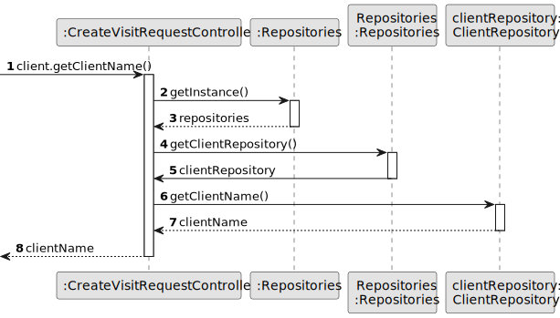

# US 009 - Create a visit request to a property

## 3. Design - User Story Realization 

### 3.1. Rationale

**SSD - Display listed properties**

| Interaction ID                                               | Question: Which class is responsible for...    | Answer                 | Justification (with patterns)                                                                                 |
|:-------------------------------------------------------------|:-----------------------------------------------|:-----------------------|:--------------------------------------------------------------------------------------------------------------|
| Step 1 -  asks to post a visit request                       | 	... interacting with the actor?               | VisitRequestUI         | Pure Fabrication: there is no reason to assign this responsibility to any existing class in the Domain Model. |
| 			  		                                                      | 	... coordinating the US?                      | VisitRequestController | Controller                                                                                                    |
| Step 2 -  show list of all properties and asks to select one | 		... knowing the properties to show?	  	      | AnnouncementRepository | Repository                                                                                                    |
| Step 3 - select a property    		                             | 	...saving the choosen property?               | VisitRequestUI         | Pure Fabrication                                                                                              |
| Step 4 - request preferred date                              | 		... asking to insert the preferred date?	  	 | VisitRequestUI         | Pure Fabrication                                                                                              |
 | Step 5 -  insert preferred date   		                         | 	...saving the preferred date typed?           | VisitRequestUI         | Pure Fabrication                                                                                              |
| 		                                                           | 	...validating the preferred date typed?       | VisitRequestUI         | Pure Fabrication                                                                                              |
| Step 6 - request time slot                                   | ... asking for the time slot information?      | VisitRequestUI         | Pure Fabrication                                                                                              |
| Step 7 - insert time slot		  		                              | 	... saving the insert time slot?              | VisitRequestUI         | Pure Fabrication                                                                                              | 
| 	  		                                                        | 	... validating the insert time slot?          | VisitRequestUI         | Pure Fabrication                                                                                              | 
|                                                              | 	...knowing the email form the current client? | currentSession         | IE: it has all the data related to the person current logged in                                               | 
|                                                              | 	...knowing the current client?                | ClientRepository       | Repository                                                                                                    | 
| 			  		                                                      | 	... knowing the client name?                  | ClientRepository       | Repository                                                                                                    |
|                                                              | 	...knowing the client phone number?           | ClientRepository       | Repository                                                                                                    |
|                                                              | 	...instantiating a new VisitRequest?          | VisitRequestMapper     | Pure Fabrication                                                                                              | 
| 			  		                                                      | 	... validating the visit request?             | VisitRequest           | The VisitRequest owns its data.                                                                               |
|                                                              | 	...saving all the visitRequest data?          | VisitRequest           | IE: The object created in here has its own data.                                                              |
| Step 8 - show success message                                | ... informing operation success?               | VisitRequestUI         | It is responsible for user interactions.                                                                      |
| Step 9 - confirmation to submit another date                 | 	...saving all the date?                       | VisitRequestUI         | It is responsible for user interactions.                                              |
| Step 10 - confirmation to submit another time slot               | ... saving all the time slots?                 | VisitRequestUI         | It is responsible for user interactions.                                                                      |

### Systematization ##

According to the taken rationale, the conceptual classes promoted to software classes are:

 * VisitRequestRepository 
 * VisitRequest
 * AnnouncementRepository
 * VisitRequestMapper

Other software classes (i.e. Pure Fabrication) identified:
 * VisitRequestUI
 * VisitRequestController

## 3.2. Sequence Diagram (SD)

### Alternative 1 - Full Diagram

This diagram shows the full sequence of interactions between the classes involved in the realization of this user story.

### Alternative 2 - Split Diagram

This diagram shows the same sequence of interactions between the classes involved in the realization of this user story, but it is split in partial diagrams to better illustrate the interactions between the classes.

It uses interaction ocurrence.

**Get Property List**

**Get Client from session**

**Get Client Name**

**Get Client Phone Number**

**Create Visit Request**

## 3.3. Class Diagram (CD)

