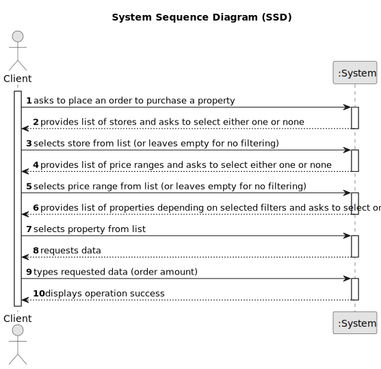

# US 010 - To place an order to purchase a property.

## 1. Requirements Engineering

### 1.1. User Story Description

As a client, I place an order to purchase the property, submitting the order amount.

### 1.2. Customer Specifications and Clarifications 

**From the specifications document:**

>	If the request is accepted by an agent, the offer will not be shown again to clients using the application. 

**From the client clarifications:**

> **Question:** In US10, can the client remove an offer they made at any point, in order to replace it with a different one?
>  
> **Answer:** No.

> **Question:** If a client makes an order of equal or lower value to a previous one, the older order will be considered first. The system should state this on the screen, but should this information be shown to the client, the agent, or both?
>  
> **Answer:** Please check who is the ator of this Us and check again the acceptance criteria of this US.

> **Question:** When the client intends to place a purchase order, should the list of properties (announcements) be presented initially and then asked to select a property?
>
> **Answer:** The system should show a list of properties to the client.

> **Question:** What data is required, in addition to the order value, so that a client can place an order to purchase a property?
> 
> **Answer:** Only the order amount.

> **Question:**  When showing the other order on the screen, what data should be shown (eg client name, published date, order status)?
>
> **Answer:** If the order amount submitted by the client has already been posted for the property (by another request from this client or any other client), the system must state that on the screen. The system should show the message "The order amount submitted has already been posted for this property. Please contact the agent that is responsible for this property.".

> **Question:** To order a purchase of a property, should the client be able to filter the properties by type of property, city, district....so that it's easier to find the wanted property, or should the system show the entire list of properties to sale?
>
> **Answer:** The system should show a list of properties to the client. Filtering is a useful feature of the system, please prepare a user friendly and effective filtering to show the properties to the client.

> **Question:** Should this User Story be implemented as an addition to US001 (Users can display properties, and select one to make an order), or should it be completely separate, with a separate section of the app dedicated to it?
> 
> **Answer:** To place an order the actor should be registered in the system.

> **Question:**  In US10, can the client remove an offer they made at any point, in order to replace it with a different one?
>
> **Answer:** No.

### 1.3. Acceptance Criteria

* **AC1:** The order amount submitted by the client must be equal to or lower than the price set by the owner for the property.
* **AC2:** If the order amount submitted by the client has already been posted for the property (by another request from this client or any other client), the system must state that on the screen and the order placed previously should be considered first when selling the property.
* **AC3:** A client can only submit a new order to purchase the same property after the previous one is declined.

### 1.4. Found out Dependencies

* There is a dependency to "US002 Publish any sale announcement" and "US008 ___" since at least one property must be listed for a client to make an order on.
* There is a dependency to "US007 Register in the system" since the client needs to be registered in the system to make an order.

### 1.5 Input and Output Data

**Input Data:**

* Typed data:
	* an order amount
	
* Selected data: 
  * a store to filter the property list (optional)
  * a price range to filter the property list (optional)
  * the property to be purchased

**Output Data:**

* A note explaining that an earlier order of the same amount will be considered first when selling the property (if one exists).
* (In)Success of the operation

### 1.6. System Sequence Diagram (SSD)

**Other alternatives might exist.**

### 1.7 Other Relevant Remarks

* n/a