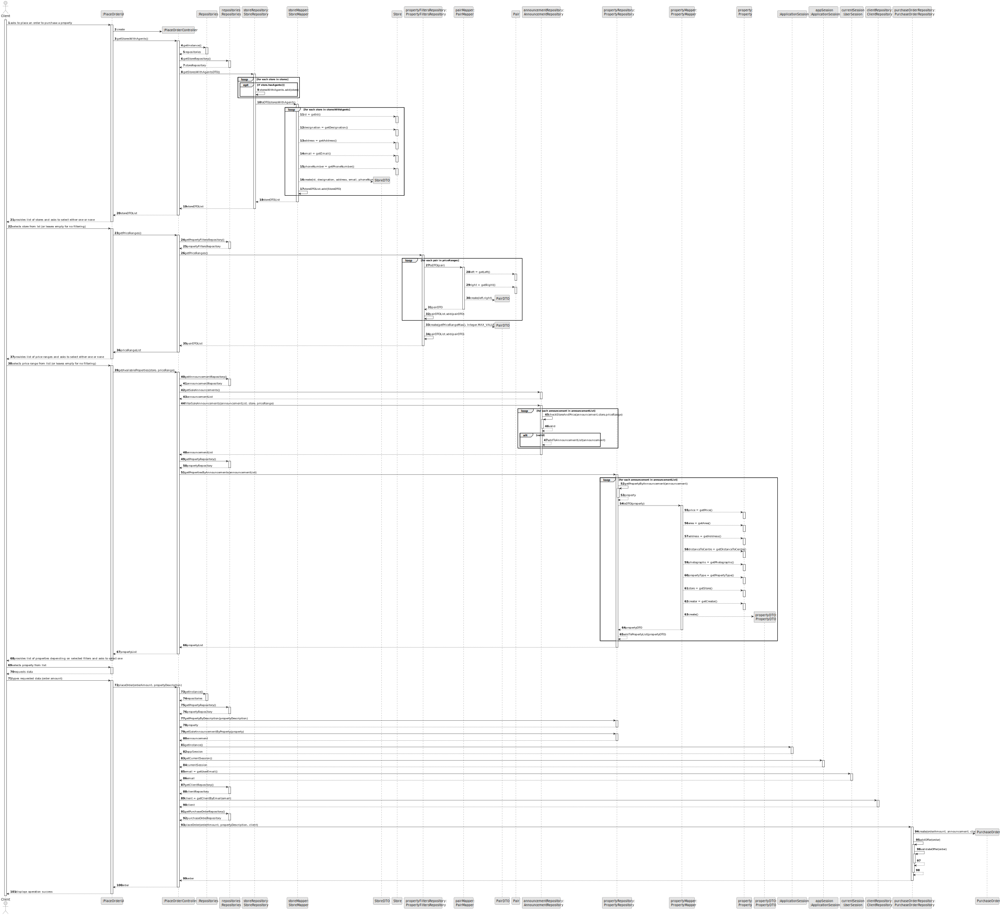
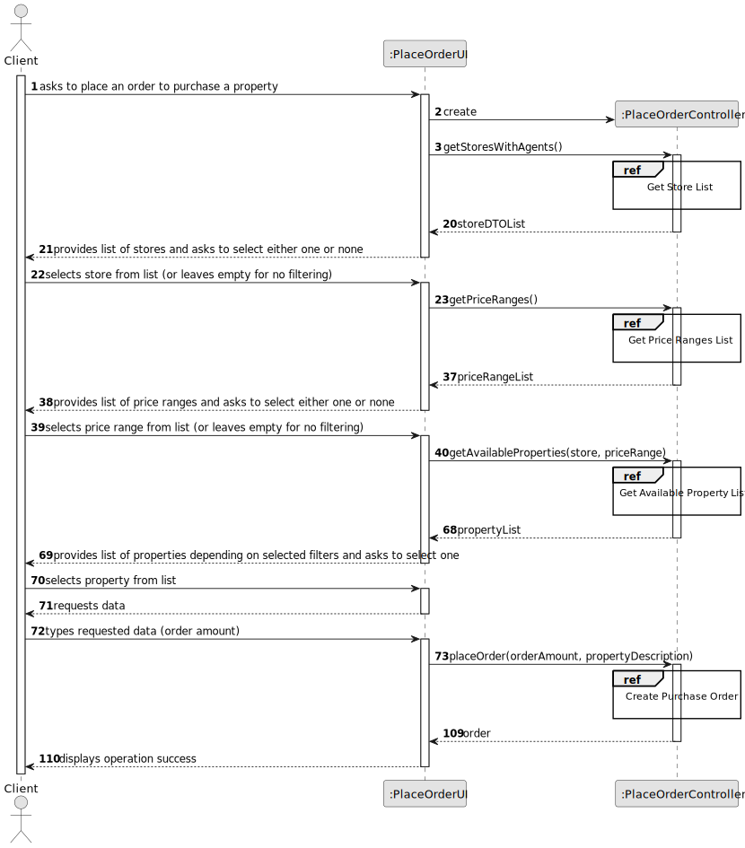
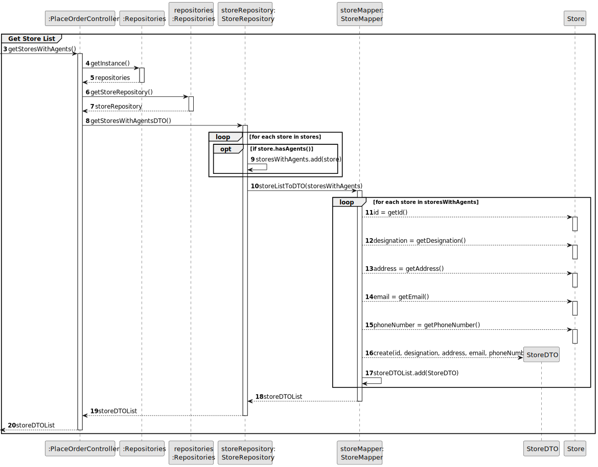
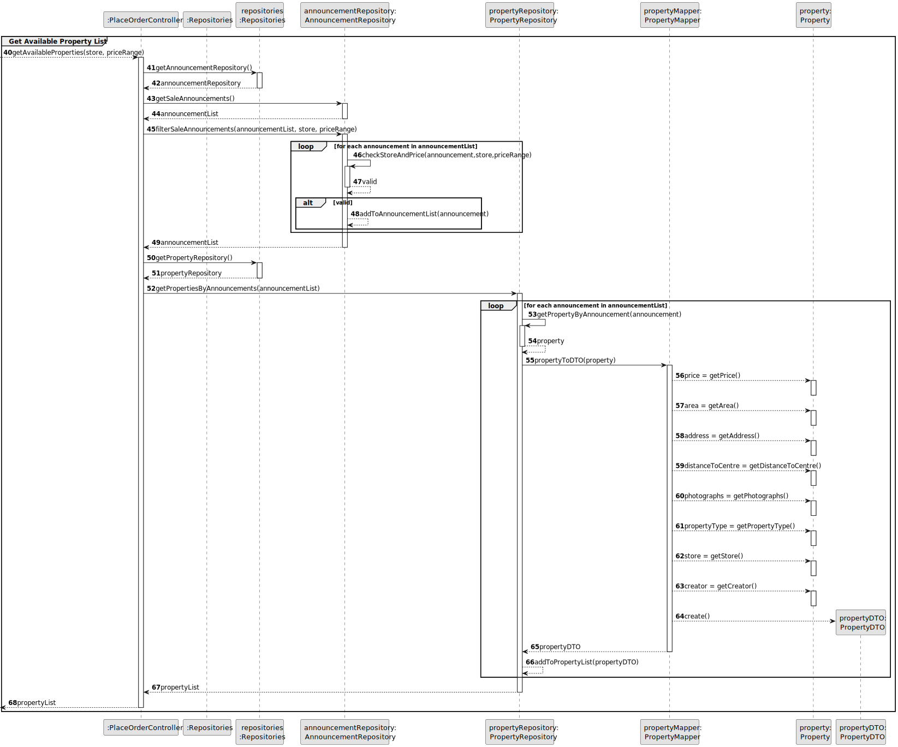
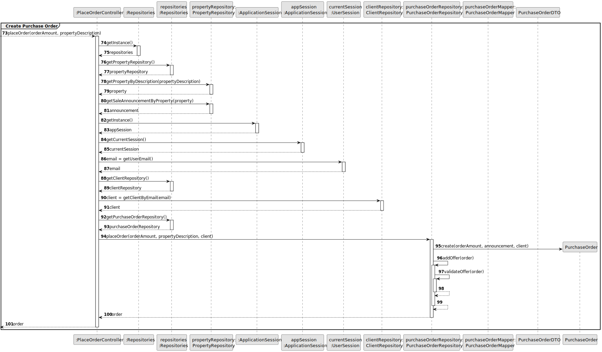
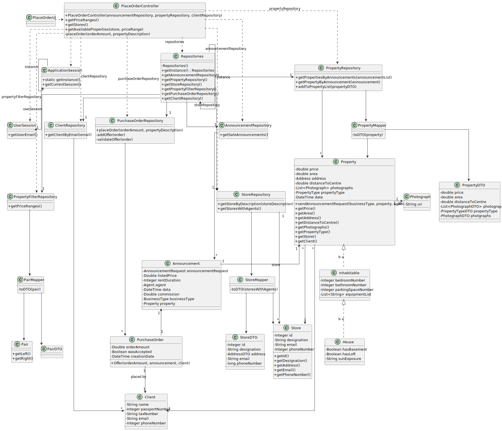

# US 010 - To place an order to purchase a property.

## 3. Design - User Story Realization 

### 3.1. Rationale

**SSD - Alternative 1 is adopted.**

| Interaction ID                                                                            | Question: Which class is responsible for... | Answer                   | Justification (with patterns)                                                                                 |
|:------------------------------------------------------------------------------------------|:--------------------------------------------|:-------------------------|:--------------------------------------------------------------------------------------------------------------|
| Step 1 - asks to place an order to purchase a property  		                                | 	... interacting with the actor?            | PlaceOrderUI             | Pure Fabrication: there is no reason to assign this responsibility to any existing class in the Domain Model. |
| 			  		                                                                                   | 	... coordinating the US?                   | PlaceOrderController     | Controller                                                                                                    |
| 			  		                                                                                   | 	... instantiating a new Offer?             | PurchaseOrderRepository  | Creator (Rule 1): PurchaseOrderRepository contains instances of PurchaseOrder.                                |
| 			  		                                                                                   | ... knowing the user using the system?      | UserSession              | IE: cf. A&A component documentation.                                                                          |
| Step 2 - provides list of stores and asks to select either one or none                    | ...knowing the Stores to show?              | StoreRepository          | Repository                                                                                                    |                    
| Step 3 - selects store from list (or leaves empty for no filtering)                       |                                             |                          |                                                                                                               |
| Step 4 - provides list of price ranges and asks to select either one or none              | ...knowing the Price Ranges to show?        | PropertyFilterRepository | Repository                                                                                                    |                    
| Step 5 - selects price range from list (or leaves empty for no filtering)                 |                                             |                          |                                                                                                               |
| Step 6 - provides list of properties depending on selected filters and asks to select one | ...knowing the Announcements to check?      | AnnouncementRepository   | Repository                                                                                                    |
|                                                                                           | 	...knowing the Property Types to show?     | PropertyRepository       | Repository                                                                                                    |
| Step 7 - selects property from list                                                       | 	...saving the inputted data?               | PurchaseOrder            | IE: object created in step 1 has its own data.                                                                |
| Step 8 - requests data                                                                    | 	                                           |                          |                                                                                                               |
| Step 9 - types requested data (order amount)                                              | 	... saving the typed data?                 | PurchaseOrder            | IE: object created in step 1 has its own data.                                                                |
| Step 10 - displays operation success                                                      | 	... informing operation success?           | PlaceOrderUI             | IE: is responsible for user interactions.                                                                     | 

### Systematization ##

According to the taken rationale, the conceptual classes promoted to software classes are: 

 * PurchaseOrder
 * SaleAnnouncement

Other software classes (i.e. Pure Fabrication) identified: 

 * PlaceOrderUI  
 * PlaceOrderController
 * UserSession
 * PurchaseOrderRepository
 * AnnouncementRepository
 * PropertyRepository
 * StoreRepository
 * PropertyFilterRepository

## 3.2. Sequence Diagram (SD)

### Alternative 1 - Full Diagram

This diagram shows the full sequence of interactions between the classes involved in the realization of this user story.

### Alternative 2 - Split Diagram

This diagram shows the same sequence of interactions between the classes involved in the realization of this user story, but it is split in partial diagrams to better illustrate the interactions between the classes.

It uses interaction ocurrence.

**Get Store List Partial SD**

**Get Price Range List Partial SD**

**Get Available Property List Partial SD**

**Create Purchase Order Partial SD**

## 3.3. Class Diagram (CD)

