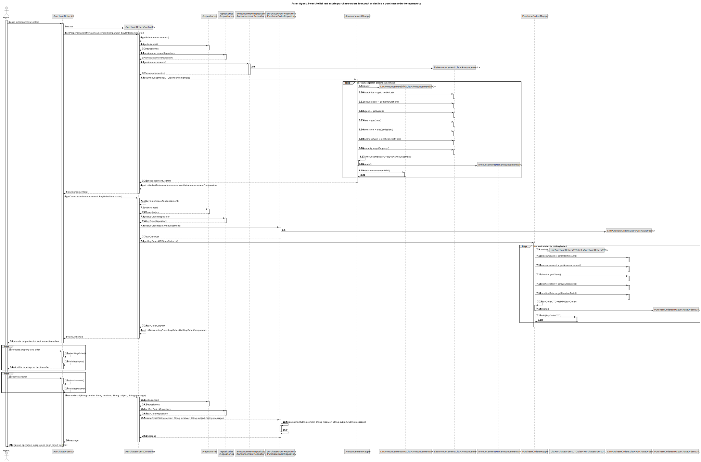
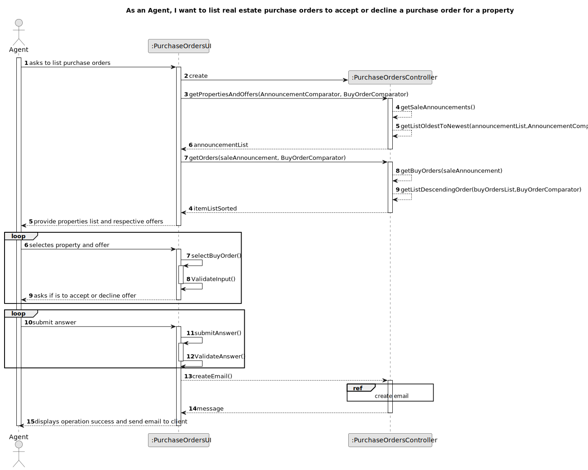
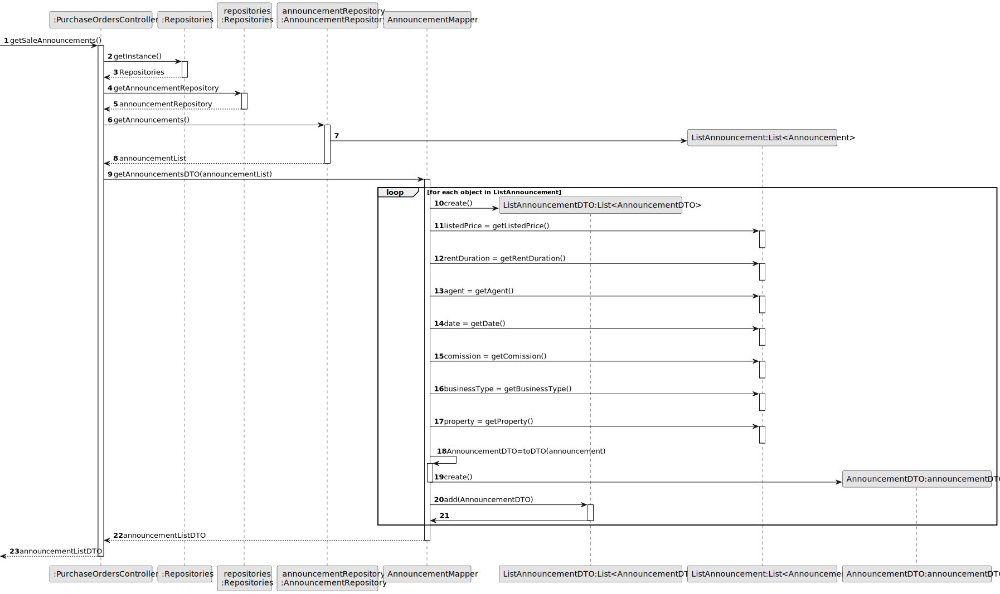
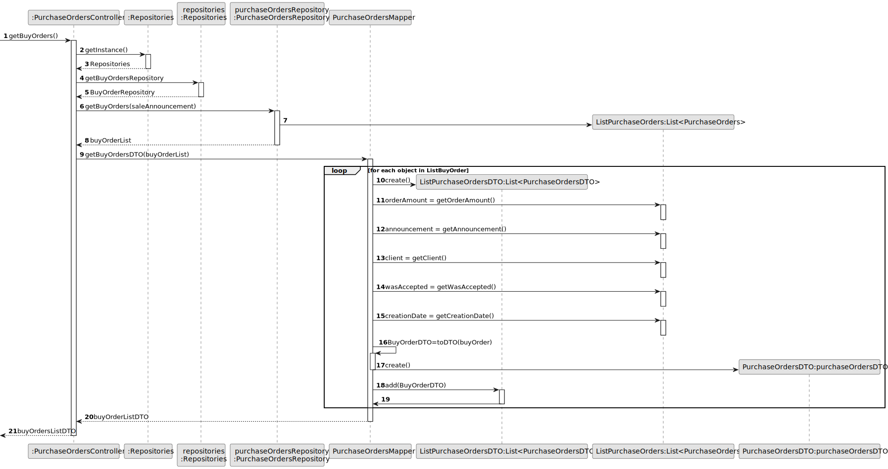
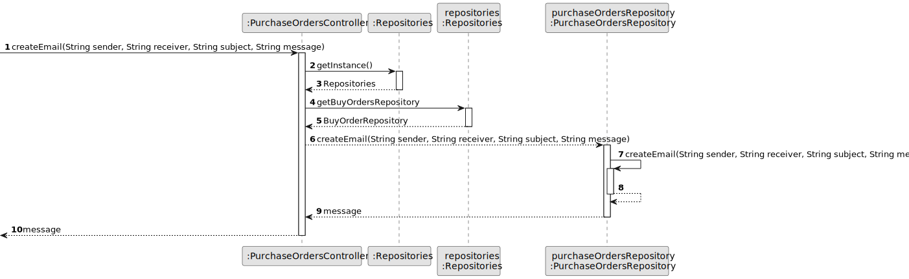
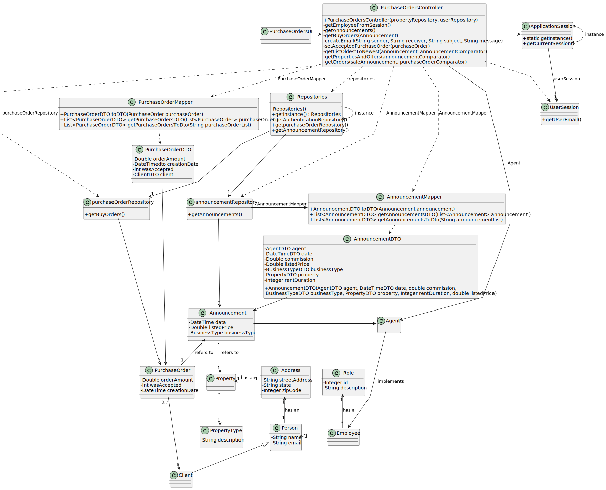

      # US 011 - List real estate purchase orders

## 3. Design - User Story Realization 

### 3.1. Rationale

**SSD - Alternative 1 is adopted.**

| Interaction ID                                                                                   | Question: Which class is responsible for...                                                  | Answer                                                | Justification (with patterns) |
|:-------------------------------------------------------------------------------------------------|:---------------------------------------------------------------------------------------------|:------------------------------------------------------|:------------------------------|
| Step 1: asks to list purchase orders  	                                                          | 	... instantiating the class that handles the UI?                                            | BuyOrdersUI                                           | Pure Fabrication              |
| 			  		                                                                                          | 	... coordinating the US?                                                                    | PurchaseOrdersController                              | Controller                    |
| 			  		                                                                                          | ... knowing the user using the system?                                                       | UserSession                                           |                               |
| Step 2: show list of sale announcements and respective purchase offers and request to select one | 	...displaying the sale announcements and purchase orders for the actor to input data?						 | announcementsRepository/ purchaseOrdersRepository | Repository                    |
| Step 3: select an announcement	                                                                  | 	... saving the choosen announcement?                                                        | BuyOrdersUI                                           | Pure Fabrication              |
| 			  		                                                                                          | 	... validating the choosen announcement?                                                    | BuyOrdersUi                                           | Pure Fabrication              | 
| Step 4: select a purchase order	                                                                 | 	... saving the choosen purchase order?                                                      | BuyOrdersUI                                           | Pure Fabrication              |
| 			  		                                                                                          | 	... validating the choosen purchase order?                                                  | BuyOrdersUi                                           | Pure Fabrication              | 
| Step 5: request confirmation  		                                                                 | 		...asks is is to accept or decline the purchase order? 					                               | BuyOrdersUI                                           | Pure Fabrication              |              
| 			  		                                                                                          | 	... validating  ?                                                                           | BuyOrdersUi                                           | Pure Fabrication              | 
| Step 6: show operation succed and sends email to the client 		                                   | 	... informing operation success?                                                            | BuyOrdersUI                                           | Pure Fabrication              | 
|  		                                                                                              | 	... sending email to the client?                                                            | BuyOrdersUI                                           | Pure Fabrication              | 

### Systematization ##

According to the taken rationale, the conceptual classes promoted to software classes are: 

 * AnnouncementsRepository
 * PurchaseOrdersRepository

Other software classes (i.e. Pure Fabrication) identified: 

 * BuyOrdersUI  
 * BuyOrdersController

## 3.2. Sequence Diagram (SD)

### Alternative 1 - Full Diagram

This diagram shows the full sequence of interactions between the classes involved in the realization of this user story.

### Alternative 2 - Split Diagram

This diagram shows the same sequence of interactions between the classes involved in the realization of this user story, but it is split in partial diagrams to better illustrate the interactions between the classes.

It uses interaction ocurrence.

**Get Sale Announcements List**

**Get Buy Orders List**

**Create Email**

## 3.3. Class Diagram (CD)

