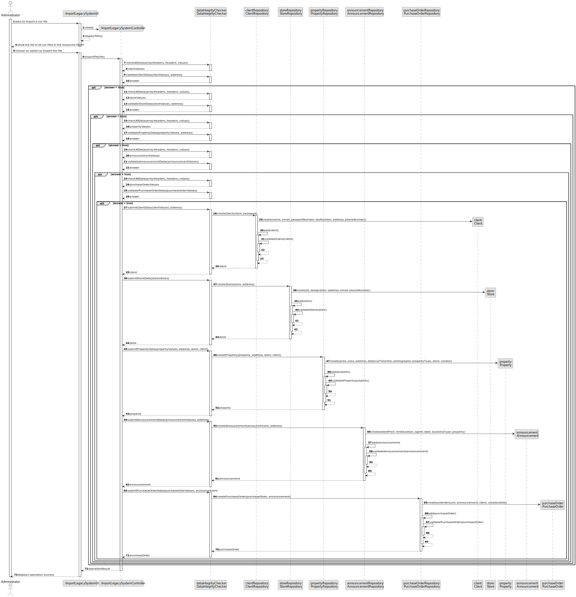
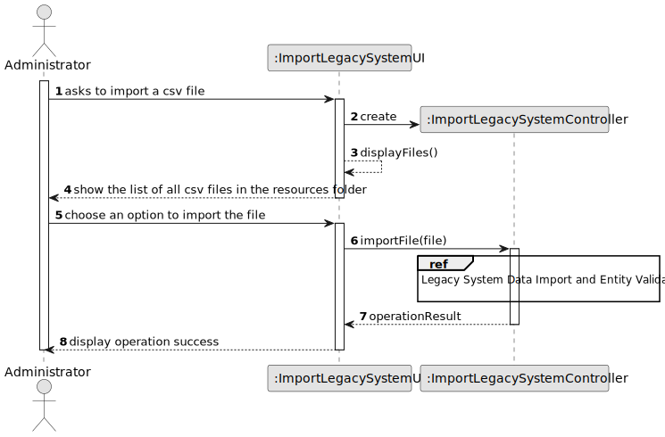
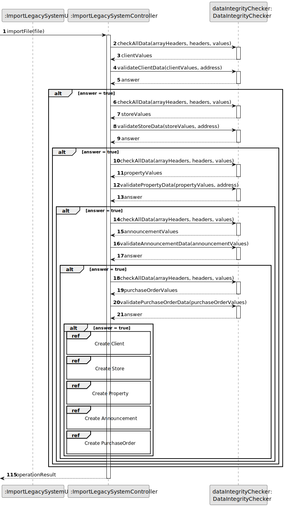
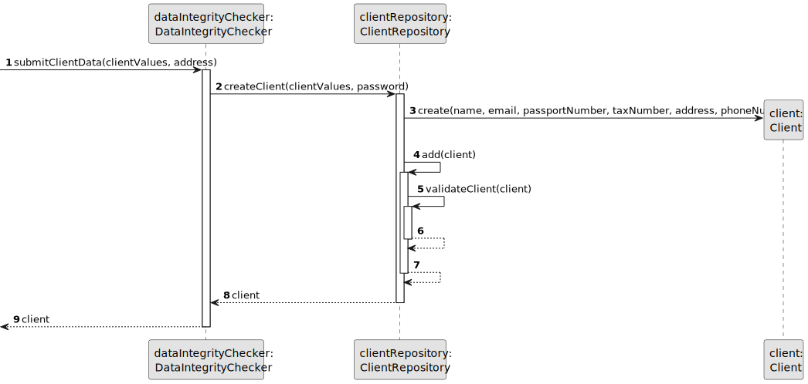
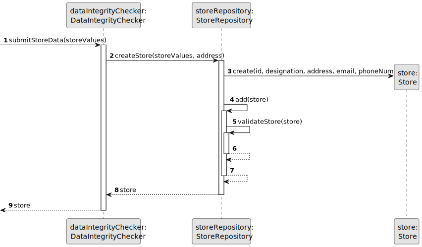
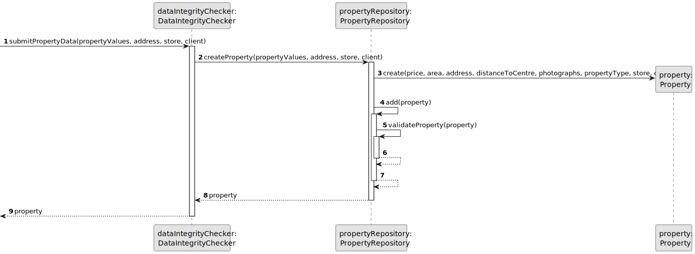
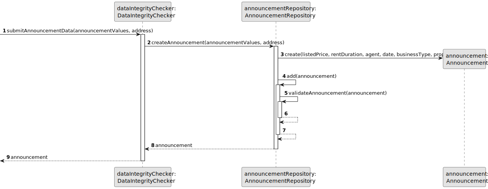
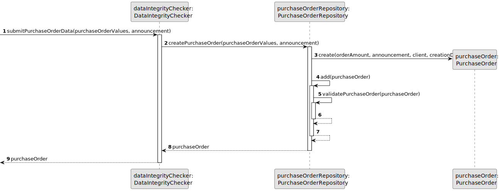
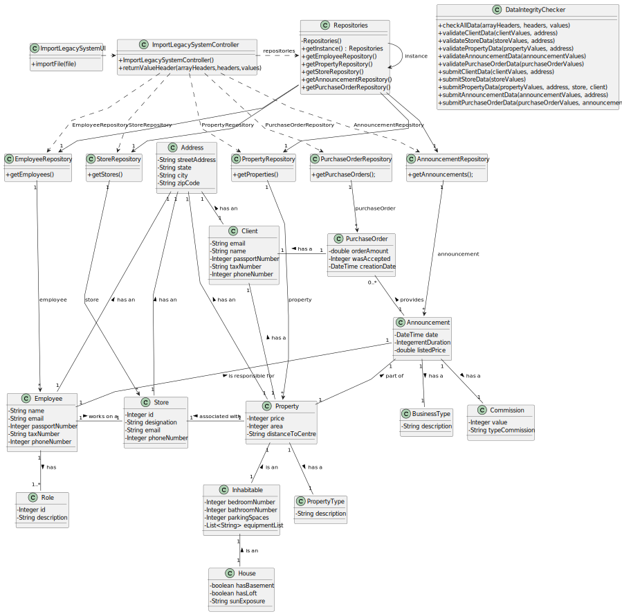

# US 012 - Import information from a legacy system

## 3. Design - User Story Realization 

### 3.1. Rationale

**SSD - Alternative 1 is adopted.**

| Interaction ID                                   | Question: Which class is responsible for...                                    | Answer                          | Justification (with patterns)                                                                                                 |
|-------------------------------------------------|-------------------------------------------------------------------------------|---------------------------------|------------------------------------------------------------------------------------------------------------------------------|
| Step 1 - asks to import a csv file               | ... interacting with the actor?                                               | ImportLegacySystemUI             | Pure Fabrication: Handles user interaction without being part of the core Domain Model.                                     |
| Step 2 - choose an option to import              | ... handling the selection of the file to import?                             | ImportLegacySystemUI             | Pure Fabrication: Handles user interaction without being part of the core Domain Model.                                     |
| Step 3 - import the file                         | ... orchestrating the import process?                                         | ImportLegacySystemController    | Controller: Orchestrates the import process and interacts with other classes.                                                |
| Step 4 - check data integrity                    | ... ensuring the integrity and validity of the imported data?                  | DataIntegrityChecker             | Service: Performs data integrity checks as part of a specific functionality.                                                  |
| Step 5 - validate client data                    | ... performing validation checks on the client data?                          | DataIntegrityChecker             | Service: Performs data validation checks as part of a specific functionality.                                                |
| Step 6 - validate store data                     | ... performing validation checks on the store data?                           | DataIntegrityChecker             | Service: Performs data validation checks as part of a specific functionality.                                                |
| Step 7 - validate property data                  | ... performing validation checks on the property data?                        | DataIntegrityChecker             | Service: Performs data validation checks as part of a specific functionality.                                                |
| Step 8 - validate announcement data              | ... performing validation checks on the announcement data?                    | DataIntegrityChecker             | Service: Performs data validation checks as part of a specific functionality.                                                |
| Step 9 - validate purchase order data            | ... performing validation checks on the purchase order data?                  | DataIntegrityChecker             | Service: Performs data validation checks as part of a specific functionality.                                                |
| Step 10 - submit client data                      | ... creating and adding a new client to the repository?                        | ClientRepository                | Repository: Responsible for data access and persistence related to clients.                                                   |
| Step 11 - submit store data                       | ... creating and adding a new store to the repository?                         | StoreRepository                 | Repository: Responsible for data access and persistence related to stores.                                                    |
| Step 12 - submit property data                    | ... creating and adding a new property to the repository?                      | PropertyRepository              | Repository: Responsible for data access and persistence related to properties.                                                |
| Step 13 - submit announcement data                | ... creating and adding a new announcement to the repository?                  | AnnouncementRepository          | Repository: Responsible for data access and persistence related to announcements.                                             |
| Step 14 - submit purchase order data              | ... creating and adding a new purchase order to the repository?                | PurchaseOrderRepository         | Repository: Responsible for data access and persistence related to purchase orders.                                           |
| Step 15 - display operation success              | ... displaying the success of the operation?                                   | ImportLegacySystemUI             | Pure Fabrication: Handles user interaction without being part of the core Domain Model.                                     |

    
### Systematization ##

According to the taken rationale, the conceptual classes promoted to software classes are: 

 * Client
 * Store
 * Property
 * Announcement
 * PurchaseOrder

Other software classes (i.e. Pure Fabrication) identified: 

* ImportLegacySystemUI
* ImportLegacySystemController
* DataIntegrityChecker
* ClientRepository
* StoreRepository
* PropertyRepository
* AnnouncementRepository
* PurchaseOrderRepository

## 3.2. Sequence Diagram (SD)

### Alternative 1 - Full Diagram

This diagram shows the full sequence of interactions between the classes involved in the realization of this user story.

### Alternative 2 - Split Diagram

This diagram shows the same sequence of interactions between the classes involved in the realization of this user story, but it is split in partial diagrams to better illustrate the interactions between the classes.

It uses interaction ocurrence.

**Legacy System Data Import and Entity Validation**

**Create Client**

**Create Store**

**Create Property**

**Create Announcement**

**Create Purchase Order**

## 3.3. Class Diagram (CD)

