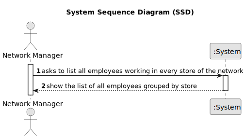

# US 013 - List all employees working in every store of the network

## 1. Requirements Engineering

### 1.1. User Story Description

As a network manager, I want to list all employees working in every store of the networkAs a system administrator, I want to register a new employee

### 1.2. Customer Specifications and Clarifications 

**From the specifications document:**

> The manager of the network intends to analyse the performance of each of the branches and the
global behaviour of the network on a daily basis.

**From the client clarifications:**

> **Question**: Do you want a list where the header is ID, the name of the store, and the total number of listings that the store has?
>
> **Answer**: Yes.

### 1.3. Acceptance Criteria

* **AC1:** The list of employees should be alphabetically sorted and grouped by store.
* **AC2:** Stores should be sorted according to their property listings, from the one with more listings to the one with less listings.
* **AC3:** Each store should state how many property listings it has.

### 1.4. Found out Dependencies

* There is a dependency to "US005 As a system administrator, I want to register a store." since at least there must be a store in the network to list.
* There is a dependency to "US003 As a system administrator, I want to register a employee." since at least there must be a employee in the store to be listed.

### 1.5 Input and Output Data

**Input Data:**

* Typed data:
	* ...
* Selected data:
	* ...

**Output Data:**

* (In)Success of the operation

### 1.6. System Sequence Diagram (SSD)

**Other alternatives might exist.**

### 1.7 Other Relevant Remarks

* ...