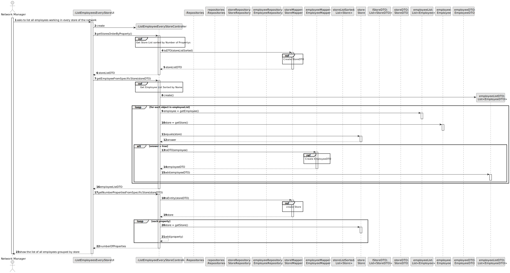

# US 013 - List all employees working in every store of the network

## 3. Design - User Story Realization 

### 3.1. Rationale

**SSD - Alternative 1 is adopted.**
Aqui está a tabela correspondente ao diagrama de sequência fornecido:

| Interaction ID                                   | Question: Which class is responsible for...                                             | Answer                             | Justification (with patterns)                                                                                                 |
|-------------------------------------------------|----------------------------------------------------------------------------------------|------------------------------------|------------------------------------------------------------------------------------------------------------------------------|
| Step 1 - asks to list all employees             | ... interacting with the actor?                                                        | ListEmployeesEveryStoreUI           | Pure Fabrication: Handles user interaction without being part of the core Domain Model.                                     |
| Step 2 - create                                 | ... creating the instance of the controller?                                           | ListEmployeeEveryStoreController    | Controller: Handles the control logic and interacts with other classes.                                                      |
| Step 3 - get stores                             | ... retrieving the list of stores from the repository?                                 | Repositories, StoreRepository       | Repository: Responsible for data access and persistence related to stores.                                                    |
| Step 4 - get sorted store list                  | ... sorting the list of stores by a specific property?                                 | StoreRepository, StoreMapper        | Mapper: Converts Store objects to StoreDTO objects.                                                                         |
| Step 5 - create store DTOs                      | ... creating the store data transfer objects (DTOs)?                                   | StoreMapper, List<Store>, StoreDTO  | Data Transfer Object (DTO): Represents the store data in a transferable format.                                              |
| Step 6 - add store DTOs to the list             | ... adding the store DTOs to the list of store DTOs?                                    | List<StoreDTO>                      | Data Transfer Object (DTO): Represents the store data in a transferable format.                                              |
| Step 7 - get employee repository                | ... retrieving the employee repository from the repository singleton?                  | Repositories, EmployeeRepository    | Repository: Responsible for data access and persistence related to employees.                                                |
| Step 8 - get sorted employee list               | ... retrieving the list of employees sorted by name from the employee repository?       | EmployeeRepository, List<Employee>  | Repository: Responsible for data access and persistence related to employees.                                                |
| Step 9 - create employee DTOs                   | ... creating the employee data transfer objects (DTOs)?                                | EmployeeMapper, List<Employee>, EmployeeDTO  | Data Transfer Object (DTO): Represents the employee data in a transferable format.                                        |
| Step 10 - filter employees by store             | ... filtering the list of employees by a specific store?                               | StoreDTO, EmployeeDTO, List<Employee>, List<EmployeeDTO>  | N/A                                                                                                                        |
| Step 11 - add employee DTOs to the list         | ... adding the employee DTOs to the list of employee DTOs?                             | List<EmployeeDTO>                   | Data Transfer Object (DTO): Represents the employee data in a transferable format.                                         |
| Step 12 - show the list of all employees        | ... displaying the list of all employees grouped by store to the actor?                 | ListEmployeesEveryStoreUI            | Pure Fabrication: Handles user interaction without being part of the core Domain Model.                                    |

### Systematization ##

According to the taken rationale, the conceptual classes promoted to software classes are: 

* Employee
* Store
* EmployeeDTO
* StoreDTO

Other software classes (i.e. Pure Fabrication) identified: 

* ListEmployeeEveryStoreUI
* ListEmployeeEveryStoreController
* StoreRepository
* RoleRepository
* EmployeeMapper
* StoreMapper

## 3.2. Sequence Diagram (SD)

### Alternative 1 - Full Diagram

This diagram shows the full sequence of interactions between the classes involved in the realization of this user story.

### Alternative 2 - Split Diagram

This diagram shows the same sequence of interactions between the classes involved in the realization of this user story, but it is split in partial diagrams to better illustrate the interactions between the classes.

It uses interaction ocurrence.

**Get Store List Sorted by Number of Propertys**

**Create StoreDTO**

**Get Employee List Sorted by Name**

**Create EmployeeDTO**

## 3.3. Class Diagram (CD)

