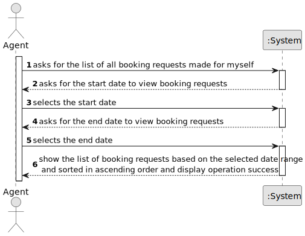

# US 015 - List Booking Requests

## 1. Requirements Engineering

### 1.1. User Story Description

As an agent, I intend to list all booking requests for properties managed by
me.

### 1.2. Customer Specifications and Clarifications 

**From the specifications document:**

>After consulting a list of properties, the client can request to schedule a visit to the real estate agent
for a specific property to verify its conditions. The agent receives the request, checks the
availability and sends the response. If the customer accepts the order, it is automatically scheduled
in the system. After carrying out the visit, the agent records the visit and an indication of whether or not he thinks
the deal will take place.

**From the client clarifications:**

> **Question:** Booking is a slightly vague word. Our team wants clarifications on what type of requests the word encompasses (visit requests being our strongest guess, but we are not sure).
>  
> **Answer:** It is a visit request.

> **Question:** US015's AC1 states that "The list of requests must be shown for a specific period (begin date, end date)". As such, our team would like to know if you want this time period to be selected or typed, and in which format it should be in.
> 
> **Answer:**  The dates should be selected. The format should be DD-MM-YYYY.

> **Question:** In US015's AC1, it is stated that "The list of requests must be shown for a specific period (begin date, end date)."
This time period caused confusion, as the team is unsure whether the "date" is referring to the date chosen by the client in the message (See US009's requirements) or the date of creation of the visit request.
> 
> **Answer:** The goal is to use the date chosen by the client (the preferred date that you can see in US9) to list booking requests.

> **Question:** One of our questions' answers made us believe there might have been some miscommunication, as it had some significant mistakes in phrasing and your answer wasn't clear enough. As such, here is that same question, in a simpler and clearer way:
US017's AC2 states that "Two sorting algorithms should be implemented (to be chosen manually by the network manager)."
US015's AC2 states that "The list of requests must be sorted by date in ascending order. The sorting algorithm to be used by the application must be defined through a configuration file. At least two sorting algorithms should be available."
As such, the team would like to know if, just like in US017, the sorting methods would be chosen manually in US015.
> 
> **Answer:** In US 15 the sorting algorithm to be used by the application must be defined through a configuration file. This is a diferent strategy from what I want in US17. Please study ESOFT.

### 1.3. Acceptance Criteria

* **AC1:** The list of requests must be shown for a specific period (begin date, end
  date)

* **AC2:** The list of requests must be sorted by date in ascending order. The sorting
  algorithm to be used by the application must be defined through a configuration
  file. At least two sorting algorithms should be available.

### 1.4. Found out Dependencies

* There a dependency to "US009- As a client, I want to leave a message to the agent to schedule a visit to a
  property of my interest.". The dependency between User Stories US015 and US009 is related to the visit scheduling functionality. US15 involves the ability for the agent to list all visit requests for the properties they manage, while US9 addresses the capability for the client to leave a message for the agent to schedule a visit to a property of their interest.

### 1.5 Input and Output Data

**Input Data:**

* Typed data:
  

**Selected data:**
  * the start date
  * the end date

**Output Data:**

* (In)Success of the operation

### 1.6. System Sequence Diagram (SSD)

**Other alternatives might exist.**

### 1.7 Other Relevant Remarks

* 