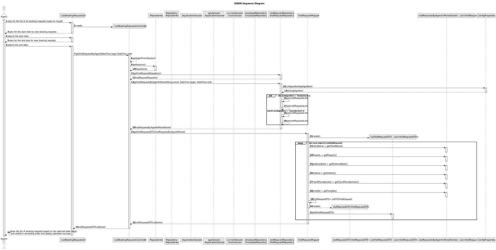
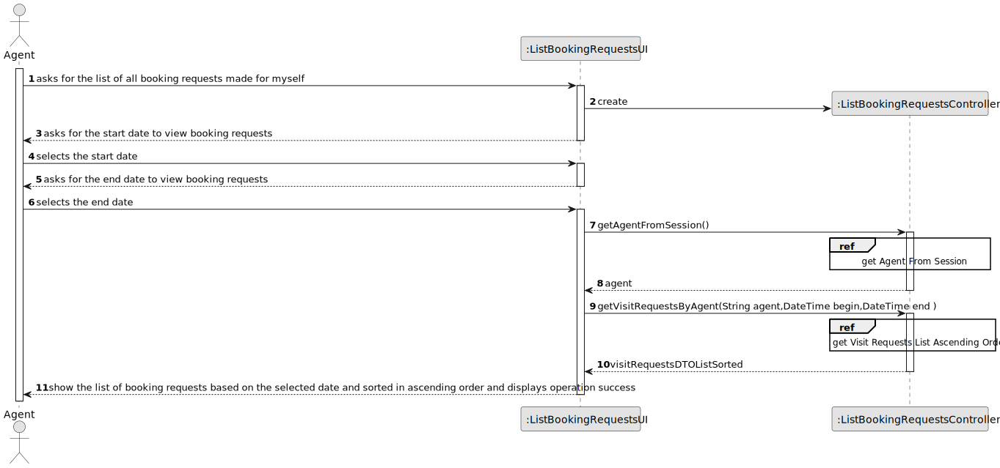
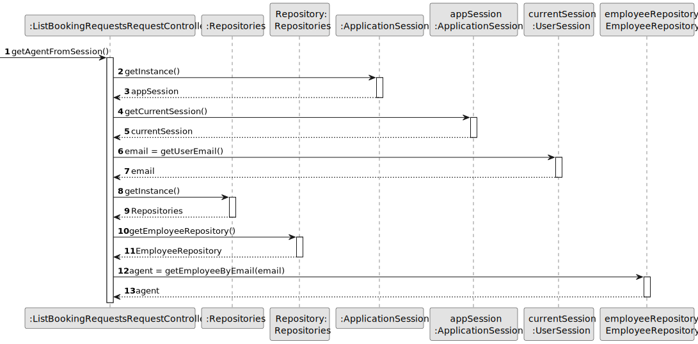
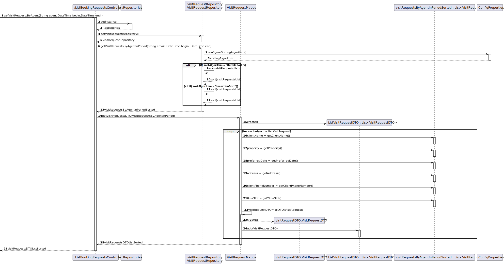

# US008 - Select and Post Announcement Request from list

## 3. Design - User Story Realization 

### 3.1. Rationale

**SSD - Alternative 1 is adopted.**

| Interaction ID                                                                                                                           | Question: Which class is responsible for...                                         | Answer                       | Justification (with patterns)                                                                                 |
|:-----------------------------------------------------------------------------------------------------------------------------------------|:------------------------------------------------------------------------------------|:-----------------------------|:--------------------------------------------------------------------------------------------------------------|
| Step 1 - asks for the list of all booking requests made for myself		                                                                     | 	...interacting with the actor?                                                     | ListBookingRequestUI         | Pure Fabrication: there is no reason to assign this responsibility to any existing class in the Domain Model. |
| 		                                                                                                                                       | 	...coordinating the US?                                                            | ListBookingRequestController | Controller                                                                                                    |
| Step 2 - asks for the start date to view booking requests                                                                                | ... asks for the start date?                                                        | listBookingRequestUI         | Pure Fabrication: there is no reason to assign this responsibility to any existing class in the Domain Model. |
| Step 3 - selects the start date                                                                                                          | ...validating selected data?                                                        | listBookingRequestUI         | Pure Fabrication: there is no reason to assign this responsibility to any existing class in the Domain Model  |                                                                     |
| Step 4 -  asks for the end date to view booking requests                                                                                 | ... asks for the end date?                                                          | ListBookingRequestUI         | Pure Fabrication: there is no reason to assign this responsibility to any existing class in the Domain Model  |
| Step 5 - selects the end date                                                                                                            | ...validating selected data?                                                        | listBookingRequestUI         | Pure Fabrication: there is no reason to assign this responsibility to any existing class in the Domain Model. |                                                                     |                                                                     |                                                                     |                                                                     |
|                                                                                                                                          | ...knowing and obtaining the email of the agent responsible for that visit request? | User session                 | 	knows/has the users on the system                                                                            |
|                                                                                                                                          | ...obtaining the employee by email?                                                 | EmployeeRepository           | IE:knows/has the employees                                                                                    |
|                                                                                                                                          | ...obtaining the booking request list?	                                             | VisitRequestRepository       | IE: Contains all visit requests                                                                               |
|                                                                                                                                          | ...obtaining the booking request Dto list?                                          | VistMapper                   |    	IE:Kowns/has its own AnnouncementRequestDto                                                                 |                                                                     |
| Step 6 - show the list of booking requests based on the selected date range  and sorted in ascending order and display operation success | ... display the list of booking requests?                                           |  listBookingRequestUI                                                                   |    Pure Fabrication: there is no reason to assign this responsibility to any existing class in the Domain Model.                                                                  |                                                                     |

### Systematization ##

According to the taken rationale, the conceptual classes promoted to software classes are: 

* Vist Request
* Property

Other software classes (i.e. Pure Fabrication) identified: 

 *  ListBookingRequestsUI
 * ListBookingRequestsController

## 3.2. Sequence Diagram (SD)

### Alternative 1 - Full Diagram

This diagram shows the full sequence of interactions between the classes involved in the realization of this user story.

### Alternative 2 - Split Diagram

This diagram shows the same sequence of interactions between the classes involved in the realization of this user story, but it is split in partial diagrams to better illustrate the interactions between the classes.

It uses interaction ocurrence.

**Get Agent from session**

**Get Visit Requests Ascending Order**

*

## 3.3. Class Diagram (CD)

