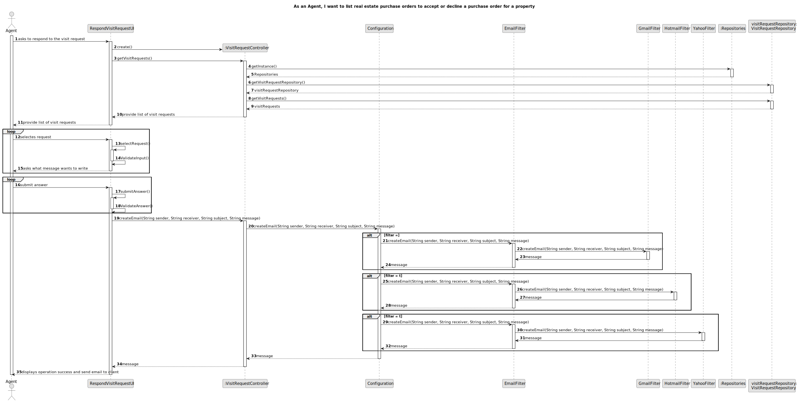
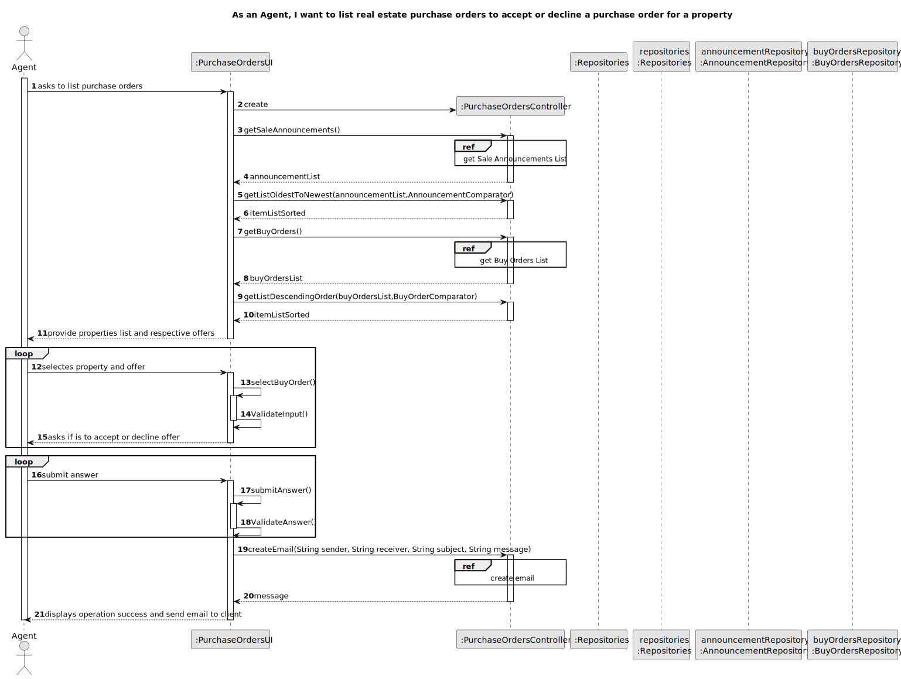
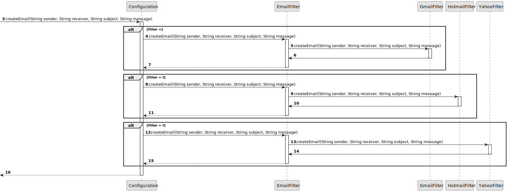
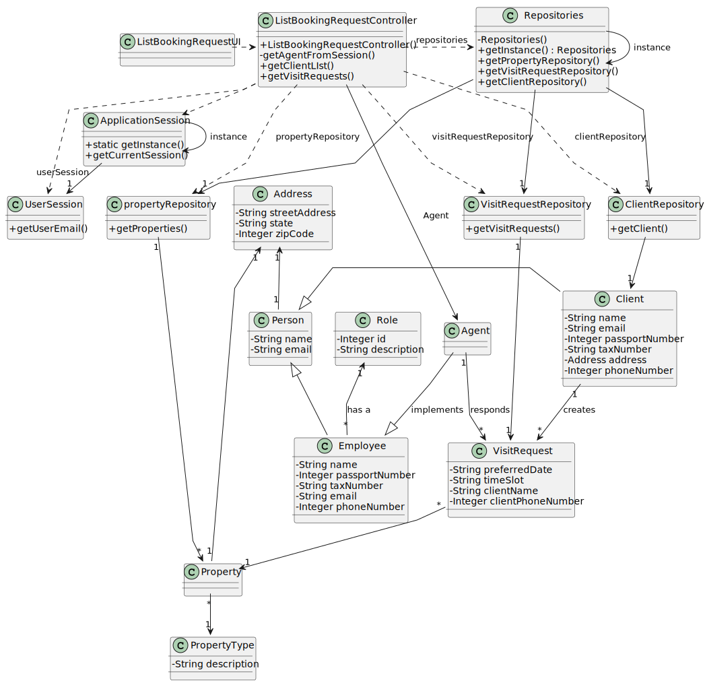

# US 016 -  Respond to the user that scheduled the visit

## 3. Design - User Story Realization 

### 3.1. Rationale

**SSD - Alternative 1 is adopted.**

| Interaction ID                                                 | Question: Which class is responsible for...                    | Answer                                                | Justification (with patterns) |
|:---------------------------------------------------------------|:---------------------------------------------------------------|:------------------------------------------------------|:------------------------------|
| Step 1: select a purchase order	                               | 	... saving the selected visit request?                        | BuyOrdersUI                                           | Pure Fabrication              |
| 			  		                                                        | 	... validating the selected visit request?                    | BuyOrdersUi                                           | Pure Fabrication              | 
| Step 2: submit answer	                                         | 	... saving the submited answer?                               | BuyOrdersUI                                           | Pure Fabrication              |
| 			  		                                                        | 	... validating answer?                                        | BuyOrdersUi                                           | Pure Fabrication              |
| Step 3: request confirmation  		                               | 		...asks is is to accept or decline the purchase order? 					 | BuyOrdersUI                                           | Pure Fabrication              |              
| 			  		                                                        | 	... validating  ?                                             | BuyOrdersUi                                           | Pure Fabrication              | 
| Step 4: show operation succed and sends email to the client 		 | 	... informing operation success?                              | BuyOrdersUI                                           | Pure Fabrication              | 
|                                                                | 	... sending email to the client?                              | BuyOrdersUI                                           | Pure Fabrication              | 

### Systematization ##

According to the taken rationale, the conceptual classes promoted to software classes are: 

 * AnnouncementsRepository
 * PurchaseOrdersRepository

Other software classes (i.e. Pure Fabrication) identified: 

 * BuyOrdersUI  
 * BuyOrdersController

## 3.2. Sequence Diagram (SD)

### Alternative 1 - Full Diagram

This diagram shows the full sequence of interactions between the classes involved in the realization of this user story.

### Alternative 2 - Split Diagram

This diagram shows the same sequence of interactions between the classes involved in the realization of this user story, but it is split in partial diagrams to better illustrate the interactions between the classes.

It uses interaction ocurrence.

**Create Email**

## 3.3. Class Diagram (CD)

