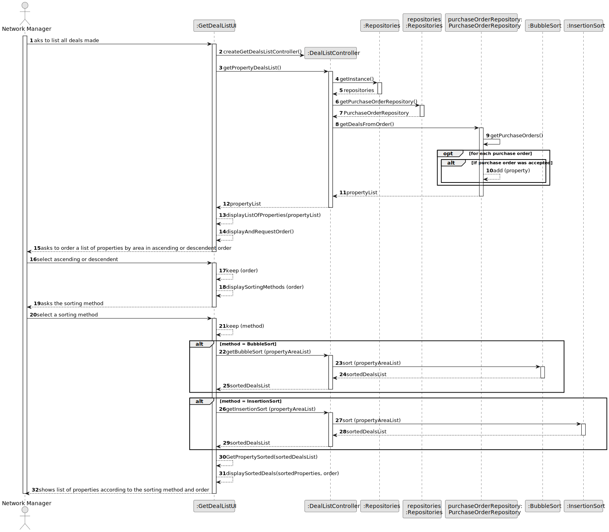
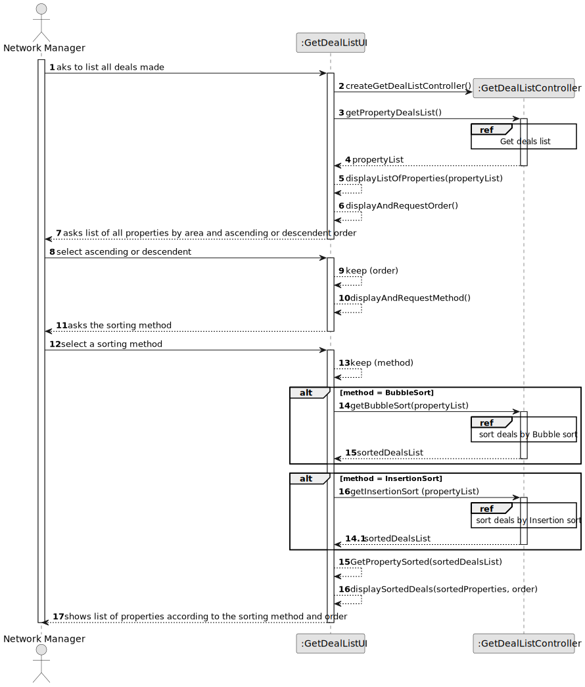
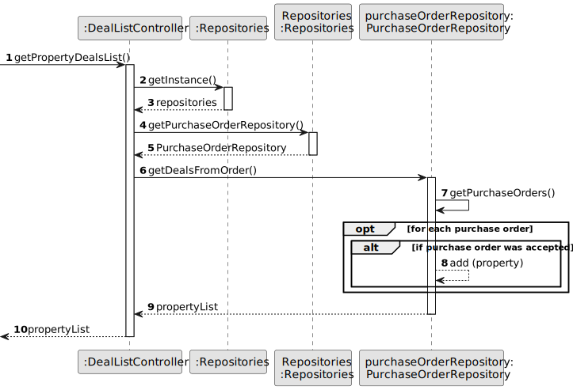
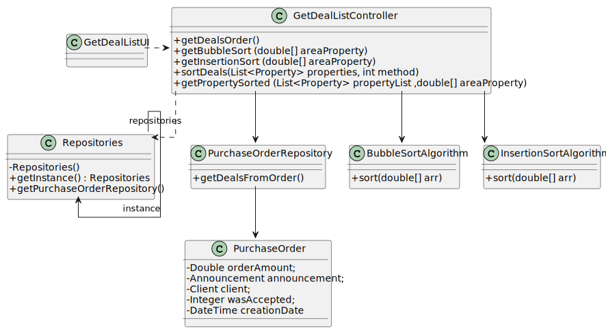

# US 017 - Display deals

## 3. Design - User Story Realization 

### 3.1. Rationale

**SSD - Display listed properties**

| Interaction ID                                                                       | Question: Which class is responsible for...                    | Answer                  | Justification (with patterns)                                                                                 |
|:-------------------------------------------------------------------------------------|:---------------------------------------------------------------|:------------------------|:--------------------------------------------------------------------------------------------------------------|
| Step 1 -  aks to list all deals made                                                 | 	... interacting with the actor?                               | GetDealListUI           | Pure Fabrication: there is no reason to assign this responsibility to any existing class in the Domain Model. |
| 			  		                                                                              | 	... coordinating the US?                                      | DealListController      | Controller                                                                                                    |
| Step 2 - asks to order a list of properties by area in ascending or descendent order | 		... knowing the properties to show?	  	                      | PurchaseOrderRepository | Repository                                                                                                    |
| Step 3 - select ascending or descendent	                                             | 	...saving the choosen order?                                  | GetDealListUI           | Pure Fabrication                                                                                              |
| Step 4 - asks the sorting method                                                     | 		... knowing what sorting method options to show	  	          | GetDealListUI           | Pure Fabrication                                                                                              |
| Step 5 - select a sorting method		                                                   | 	...asking to insert the sorting method?                       | GetDealListUI           | Pure Fabrication                                                                                              |
|                                                                                      | 	...saving all the data?                                       | GetDealsListUI          | Pure Fabrication                                                                                              |
|                                                                                      | ...sorting the deals according to the first sorting method?    | BubbleSortAlgorithm     | It has the merge sort algorithm                                                                               |
|                                                                                      | ...sorting the deals according to the second sorting method? | InsertionSortAlgorithm  | It has the heap sort algorithm                                                                                |
|                                                                                      | ...dysplaying the deals according to the order?                | GetDealListUI           | It is responsible for user interactions.                                                                      |

### Systematization ##

According to the taken rationale, the conceptual classes promoted to software classes are:

 * PurchaseOrderRepository 
 * BubbleSortAlgorithm
 * InsertionSortAlgorithm

Other software classes (i.e. Pure Fabrication) identified:
 * GetDealListUI
 * GetDealListController

## 3.2. Sequence Diagram (SD)

### Alternative 1 - Full Diagram

This diagram shows the full sequence of interactions between the classes involved in the realization of this user story.

### Alternative 2 - Split Diagram

This diagram shows the same sequence of interactions between the classes involved in the realization of this user story, but it is split in partial diagrams to better illustrate the interactions between the classes.

It uses interaction ocurrence.

**Get Deals List**

**Get Deals List by Bubble Sort Algorithm**

**Get Deals List by Insertion Sort Algorithm**

## 3.3. Class Diagram (CD)

