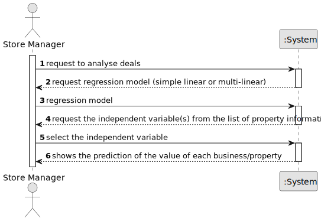

# US 018 -  Analyse Deals

## 1. Requirements Engineering

### 1.1. User Story Description

* As a store manager, I intend to analyse the deals (only sale of houses and
  apartments) made. In particular, I intend to compare property sale values with the
  forecast values. The prediction of the value of the business/property must be
  estimated based on the characteristics of the property and using linear and
  multilinear regression algorithms.

### 1.2. Customer Specifications and Clarifications 

**From the specifications document:**

> The main functions of a store manager are to monitor and streamline the branch with the
aim of getting to know better the business carried out and to analyse and evaluate the performance
of employees.

**From the client clarifications:**

> **Question:** When the store manager selects simple-linear regression to analyse the deals, does he also select one of the specified relevant parameters to serve as the [in]dependent variable in the regression model? ("property area in square feet, the distance from the center, the number of bedrooms, the number of bathroomsand the number of parking spaces").
>
> **Answer:** The store manager should choose the independent variable and the regression model to be used to fit the data. Important: The property area is always in square feet. There is no need to convert the values loaded from the file.

> **Question:**  In US018 it is stated that its purpose is to analyse deals made in order to "compare property sale values with the forecast values". However I don't understand what exactly does the user input. Does the user select a property and receives it's predicted value? Does he select a deal and compares the sale price with the predicted price? Or does he not input anything (other than the desired regression model) and just gets the regression model as output? If so, does he receive the regression model as a graph or just as an equation?
>
> **Answer:** Please discuss this question with MATCP teachers. Moreover, please read carefully the AC3 of US18.
In a previous answer I also said:
"n USs 17, 18 and 19, the network manager and the store manager should be able to explore/analyze ALL deals that are registered in the system.
To develop the work required by MATCP and MDISC courses, you should have a clean/empty system and you should load the CSV file that is already available in moodle (please the link "CSV file generated by the legacy system to be explored in US17, US18 and US19" available in moodle)."

### 1.3. Acceptance Criteria

* **AC1:** . The goal of this US is to forecast property sale prices (only for houses and
  apartments) using information from the property area (in square feet), the
  distance from the center (in miles), the number of bedrooms, the number of
  bathrooms and the number of parking spaces features of each property. In this
  study, simple linear and a multi-linear regression models should be developed to
  find the linear relationship between: 1- each independent variable and the
  dependent variable; 2- all independent variables and the dependent variable. As
  the application is under development it is not possible to generate all data
  required for the analysis. Therefore, and to simulate a production system, we
  made available in moodle a CSV file (generated by the legacy system) containing
  information required for this study. The regression analysis should be
  documented in the application user manual (in the annexes) that must be
  delivered with the application. The report should include property values/prices
  (sale prices and forecast prices), the regression model used to estimate each
  value, R(SLR), R2 and R2 adjusted for SLR and MLR, confidence intervals and
  hypothesis tests for regression coefficients and significance model with Anova

* **AC2:** All houses and apartments business registered in the system should be used
  to fit the regression models.

* **AC3** The system should enable the actor to select each regression model and
  should present the price estimates using the selected model. Moreover, the
  system should show the selected regression model and all required statistics.

* **AC4** To implement this US the org.apache.commons.math4.stat package
  (https://commons.apache.org/proper/commons-math/userguide/stat.html)
  should be used.

### 1.4. Found out Dependencies

* US002 "As an agent, I can publish any sale announcement on the system, for example received through a phone call."
* US008 "As an agent, I intend to see the list of property announcement requests made to myself, so that I can post the announcement."
* US012 "As a system administrator, I want to import information from a legacy system that has been in use in several agencies."

### 1.5 Input and Output Data

**Input Data:**

* Selected data:
  * the regression model
  * the independent variable(s) from the property information (only houses and apartments): area (in square feet), the
    distance from the center (in miles), the number of bedrooms, the number of
    bathrooms and the number of parking spaces features

	

**Output Data:**

* A prediction of the value of a property based on the value of the independent variable(s)

### 1.6. System Sequence Diagram (SSD)

### 1.7 Other Relevant Remarks

* n/a