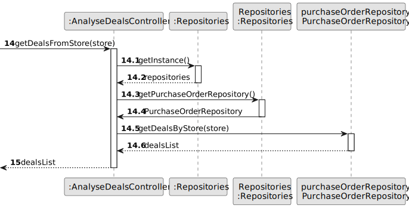

# US 018 - Analyse Deals

## 3. Design - User Story Realization 

### 3.1. Rationale

**SSD - Display listed properties**

| Interaction ID                                                                                          | Question: Which class is responsible for...             | Answer                  | Justification (with patterns)                                                                                 |
|:--------------------------------------------------------------------------------------------------------|:--------------------------------------------------------|:------------------------|:--------------------------------------------------------------------------------------------------------------|
| Step 1 -  request to analyse deals                                                                      | 	... interacting with the actor?                       | AnalyseDealsUI          | Pure Fabrication: there is no reason to assign this responsibility to any existing class in the Domain Model. |
| 			  		                                                                                                 | ... coordinating the US?                      | AnalyseDealsController  | Controller                                                                                                    |
| Step 2 - request regression model (simple linear or multi-linear)                                       | ... knowing the regression model options to show		 | AnalyseDealsUI          | Pure Fabrication                                                                                              |
| Step 3 - select regression model                                                                        | ... saving the selected regression model                | AnalyseDealsUI          | Pure Fabrication                                                                                              |
| Step 4 - request the independent variable(s) from the list of property information                      | ... knowing the list of variables to show?              | PropertyRepository      | Information Expert                                                                                            |
| Step 5 - select the independent variable                                                                | ... saving the selected variable                        | AnalyseDealsUI          | Pure Fabrication                                                                                              |
| Step 6 - shows a prediction of the value of a property based on the value of the independent variable(s) | ... calculating the regression?                        | RegressionAnalysis      | Pure Fabrication                                                                                              |
|                                                                                                         | ... knowing the store to search for deals?              | StoreManager            | According to the Domain Model the storeManager has associated stores                                       |
|                                                                                                         | ... knowing the deals to be used?                       | PurchaseOrderRepository | Information Expert                                                                                            |
|                                                                                                         | ... knowing the value of the deal?                      | PurchaseOrder           | Information Expert                                                                                            |
|                                                                                                         | ... displaying the regression?                          | AnalyseDealsUI          | Pure Fabrication                                                                                              |

### Systematization ##

According to the taken rationale, the conceptual classes promoted to software classes are:
* PurchaseOrder
* StoreManager
* RegressionAnalysis

Other software classes (i.e. Pure Fabrication) identified:
* AnalyseDealsUI
* AnalyseDealsController
* PurchaseOrderRepository

## 3.2. Sequence Diagram (SD)

### Alternative 1 - Full Diagram

This diagram shows the full sequence of interactions between the classes involved in the realization of this user story.

### Alternative 2 - Split Diagram

This diagram shows the same sequence of interactions between the classes involved in the realization of this user story, but it is split in partial diagrams to better illustrate the interactions between the classes.

It uses interaction ocurrence.

**Get Independent Variables**

**Get Deals From Store**

**Get Deals Values**

## 3.3. Class Diagram (CD)

