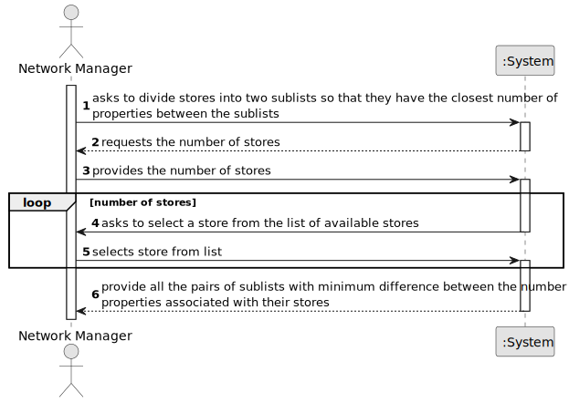

# US 019 - Divide Stores into two subsets.

## 1. Requirements Engineering

### 1.1. User Story Description

As a network manager, I want to divide the set of all stores into two subsets, so that the total number of properties of the stores between the two subsets is the closest possible.

### 1.2. Customer Specifications and Clarifications 

**From the specifications document:**

**From the client clarifications:**

> **Question 1:**  In US019, our team had some doubts regarding the information that is going to be analyzed. According to many MDISC teachers, we are only supposed to process the information within a CSV file chosen by the network manager. However, in the US description and acceptance criteria there isn't any mention of this, implying that we need to use all the information that's registered in our system. This situation also applies to MATCP, seeing the regression models, according to subject teachers, also should be generated using the CSV file information. Additionally, if it is only supposed to be the CSV file information, can we ask for the file path of it?
>
> **Question 2:** Should the CSV legacy file be used as a file that has the purchase orders that were accepted and therefore be used in the US019 or does the CSV file not contain the type of deals we are looking for?
>  
> **Answer:** In USs 17, 18 and 19, the network manager and the store manager should be able to explore/analyze ALL deals that are registered in the system. To develop the work required by MATCP and MDISC courses, you should have a clean/empty system and you should load the CSV file that is already available in moodle (please the link "CSV file generated by the legacy system to be explored in US17, US18 and US19" available in moodle).

### 1.3. Acceptance Criteria

* **AC1:** The algorithm must calculate all the partitions of cardinal 2 and find out which one is the minimum for the difference of the sum of the elements of each sublist.
* **AC2:** The algorithm should return the sublists of the partition (each sublist should contain a set of tuples with two elements each, the storeID and the number of properties manage by the store) that satisfies the stated condition and also the difference between the sums of the elements of the sublists.
* **AC3:** Cannot input an n larger than the total number of Stores.
* **AC4:** Cannot input an n equal to 1.
* **AC5:** Cannot enter repeated stores.

### 1.4. Found out Dependencies

* There is a dependency to "US005: As a system Administrator, I want to register a new store." since at least two Stores must exist for the algorithm to divide them between two subsets.
* There is a dependency to "US012: As a system administrator, I want to import information from a legacy
  system that has been in use in several agencies." since at leats two Stores must exist for the algorithm to divide them between two subsets.

### 1.5 Input and Output Data

[//]: # (**Input Data:**)

[//]: # (* Typed data:)
[//]: # (	* a number of stores &#40;n&#41;)
	
[//]: # (* Selected data:)
[//]: # (	* n number of Stores.)

**Output Data:**

* Sublists of the partition that satisfy the condition
* The difference between the sums of the elements of the sublists.
* (In)Success of the operation

### 1.6. System Sequence Diagram (SSD)

[//]: # (**Other alternatives might exist.**)

[//]: # (#### Alternative One)

[//]: # (#### Alternative Two)

[//]: # (![System Sequence Diagram - Alternative Two]&#40;svg/us006-system-sequence-diagram-alternative-two.svg&#41;)
