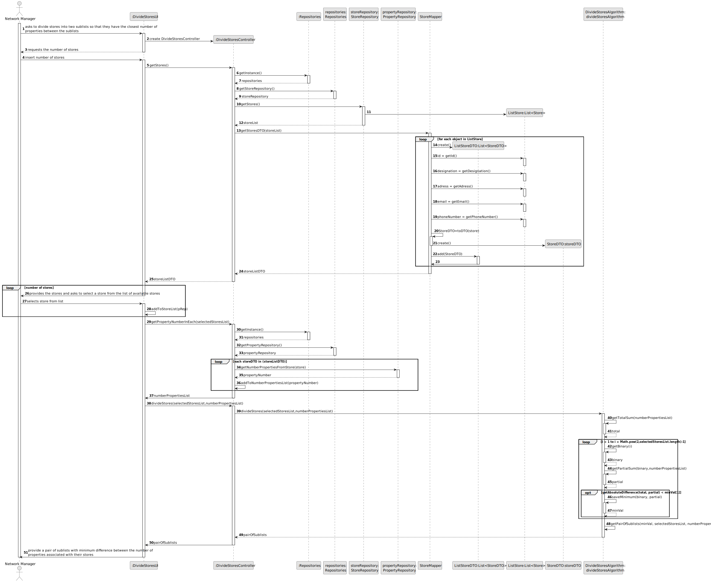
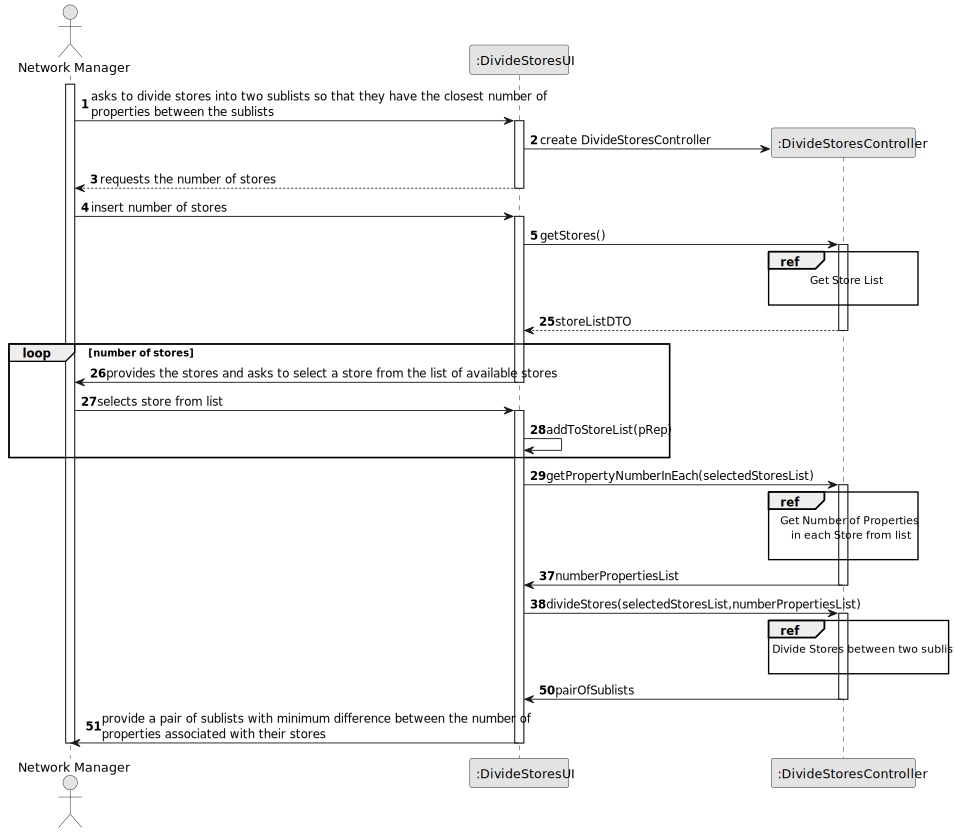
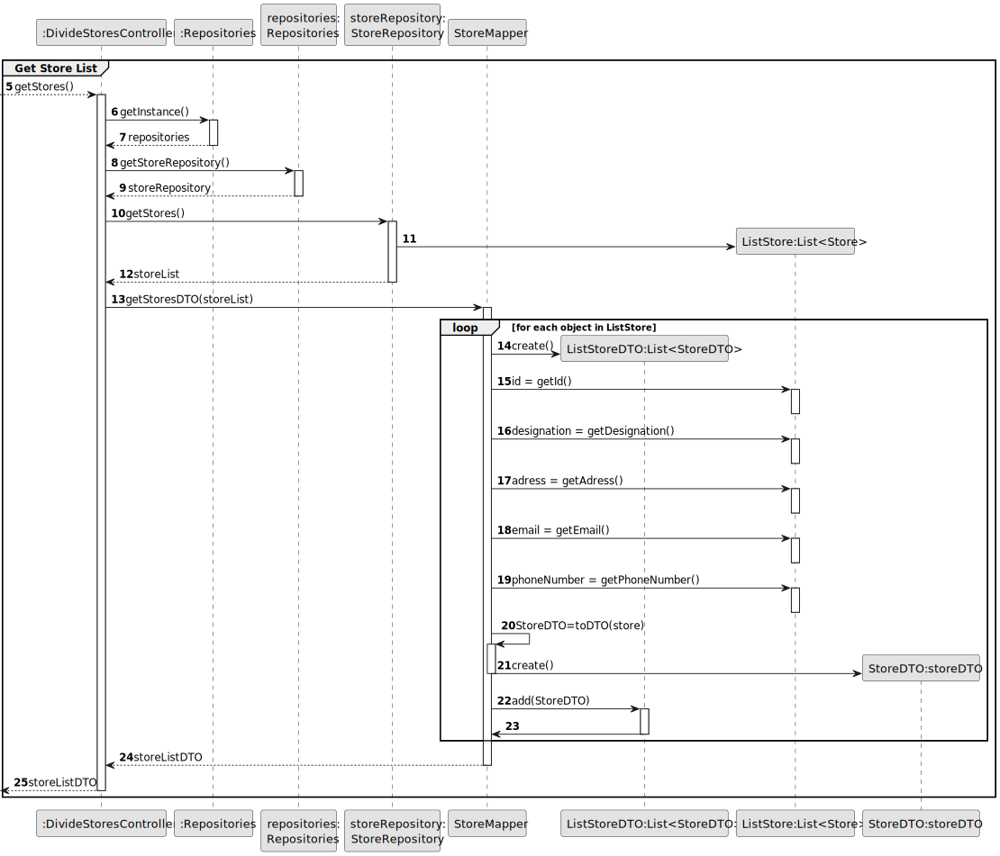
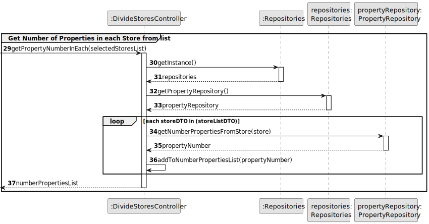
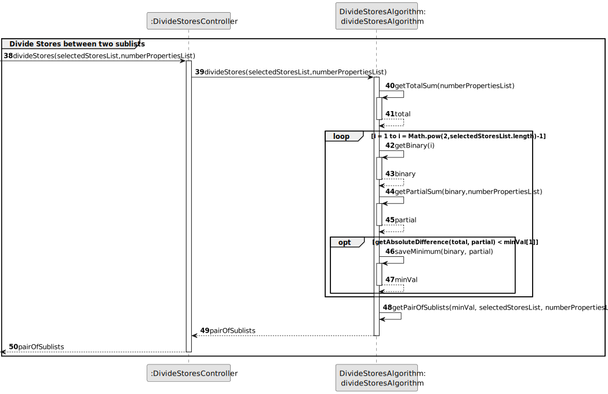
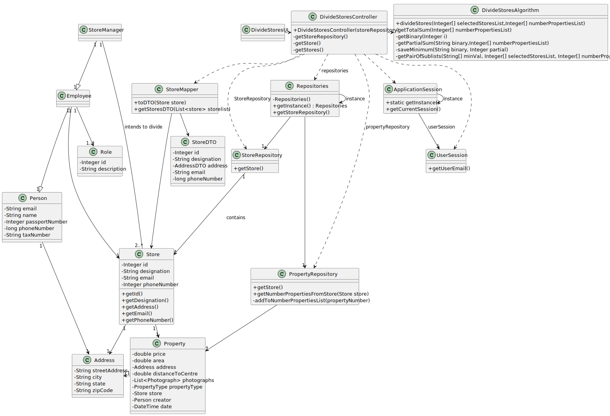

# US 019 - Divide Stores into two subsets.

## 3. Design - User Story Realization 

### 3.1. Rationale

**SSD**

| Interaction ID                                                                                                                   | Question: Which class is responsible for...              | Answer                 | Justification (with patterns)                                                                                 |
|:---------------------------------------------------------------------------------------------------------------------------------|:---------------------------------------------------------|:-----------------------|:--------------------------------------------------------------------------------------------------------------|
| Step 1 - asks to divide stores into two sublists so that they have the closest number of properties between the sublists 		      | 	... interacting with the actor?                         | DivideStoresUI         | Pure Fabrication: there is no reason to assign this responsibility to any existing class in the Domain Model. |
| 			  		                                                                                                                          | 	... coordinating the US?                                | DivideStoresController | Controller                                                                                                    |
| Step 2 - requests the number of stores 		                                                                                        | 	...requesting the number of stores	                     | DivideStoresUI         | Pure Fabrication: there is no reason to assign this responsibility to any existing class in the Domain Model. |
| Step 3 - provides the number of stores 		                                                                                        | 	...saving the inputted data?                            | DivideStoresUI         | Pure Fabrication: there is no reason to assign this responsibility to any existing class in the Domain Model. |
| Step 4 - asks to select a store from the list of available stores 		                                                             | 	...knowing the available stores to show?                | StoreRepository        | Repostiory                                                                                                    |
| Step 5 - selects store from list 		                                                                                              | 	... saving the selected store?                          | DivideStoresUI         | Pure Fabrication: there is no reason to assign this responsibility to any existing class in the Domain Model. |
|                                                                                                                                  | 	... validating the selected store?		                    | DivideStoresUI         | It is responsible for user interactions.                                                                      |              
| Step 6 - provide all the pairs of sublists with minimum difference between the number of properties associated with their stores | 	... calculating and saving the pairs of the sublist?			 | DivideStoresAlgorithm  | Pure Fabrication: there is no reason to assign this responsibility to any existing class in the Domain Model. |              
|                                                                                                                                  | 	... displaying the pairs of the sublist?			             | DivideStoresUI         | It is responsible for user interactions.                                                                      |              

### Systematization ##

According to the taken rationale, the conceptual classes promoted to software classes are: 

 * StoreRepository
 * DivideStoresAlgorithm

Other software classes (i.e. Pure Fabrication) identified: 

 * DivideStoresUI  
 * DivideStoresController

## 3.2. Sequence Diagram (SD)

### Alternative 1 - Full Diagram

This diagram shows the full sequence of interactions between the classes involved in the realization of this user story.

### Alternative 2 - Split Diagram

This diagram shows the same sequence of interactions between the classes involved in the realization of this user story, but it is split in partial diagrams to better illustrate the interactions between the classes.

It uses interaction ocurrence.

**Get Store List**

**Get Number of Properties in each Store from list**

**Divide Stores between two sublists**

## 3.3. Class Diagram (CD)

