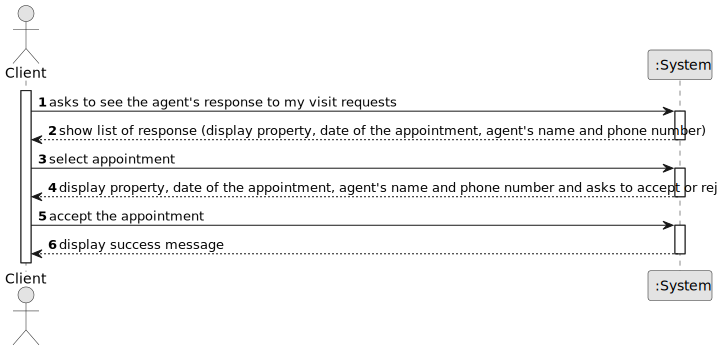

# US 020 - Response to the appointment request

## 1. Requirements Engineering

### 1.1. User Story Description

* As a client, I want to read the response for the appointment request, to
  accept or reject it.

### 1.2. Customer Specifications and Clarifications 

**From the specifications document:**

* n/a

**From the client clarifications:**

> **Question:** The reason for declining the appointment should be selected from predefined options or entered as free text?
>
> **Answer:** The message should be entered as free text.

> **Question:** When the agent rejects the visit request it doesn't make sense for the client to accept or reject that. What should be the options for the client in that case?
>
> **Answer:** When the agent rejects the visit, the client should only acknowledge that he is aware of the agent's answer.

> **Question:** Should the response for the booking request be displayed in the console? Or is it implied that the client saw the response in the email and knows what is being handled?
>
> **Answer:** The agent must be notified by email when the message is displayed to the client.

> **Question:** Which email address sents a message to the agent when the client visualizes the agent's response to the booking request?
>
> **Answer:** In US20 there is no e-mail being sent to the client. The client reads the agent response using the application.

> **Question:** We have to present information about the deal, but is it necessary to display any information about the agent/agency that oversees the deal?
>
> **Answer:** Yes, show the store ID and the store name.

> **Question:** But the agent is informed by email when the client visualizes his response. Which email adress sends that message to the agent?
>
> **Answer:** The client e-mail.

### 1.3. Acceptance Criteria

* **AC1:** The agent must be notified when the message is displayed to the client.
* **AC2:** The appointment request must provide information about the property and
  the date of the appointment.
* **AC3** When the appointment is rejected, the client must specify the reason.
* **AC4** The appointment request must provide the agent name and phone number.
* **AC5** The deal must show the store ID and the store name.

### 1.4. Found out Dependencies

* US9: As a client, I want to leave a message to the agent to schedule a visit to a
  property of my interest.

* US16: As an agent, when viewing a booking request, I want to respond to the user
  that scheduled the visit.

* US15: As an agent, I intend to list all booking requests for properties managed by
  me.

### 1.5 Input and Output Data

**Input Data:**

* Selected data:
  * visit request's information (property and date)
  * agent's name
  * agent's phone number
  
* Typed data:
  * appointment's response

**Output Data:**

* Response to the appointment request
* (In)Success of the operation

### 1.6. System Sequence Diagram (SSD)

### 1.7 Other Relevant Remarks

* n/a