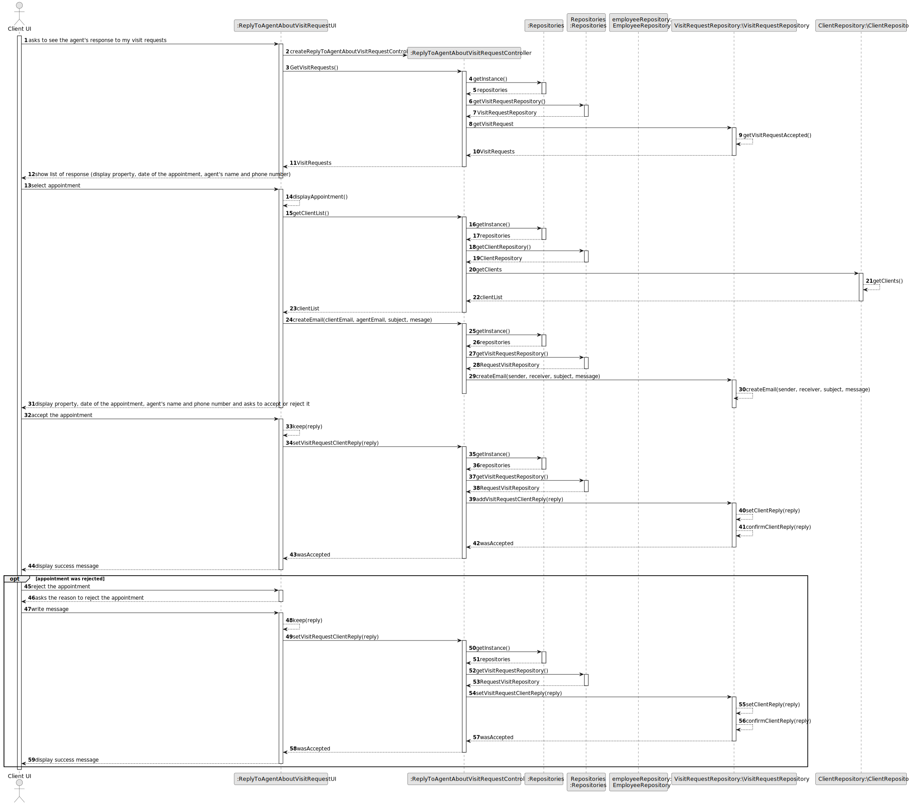
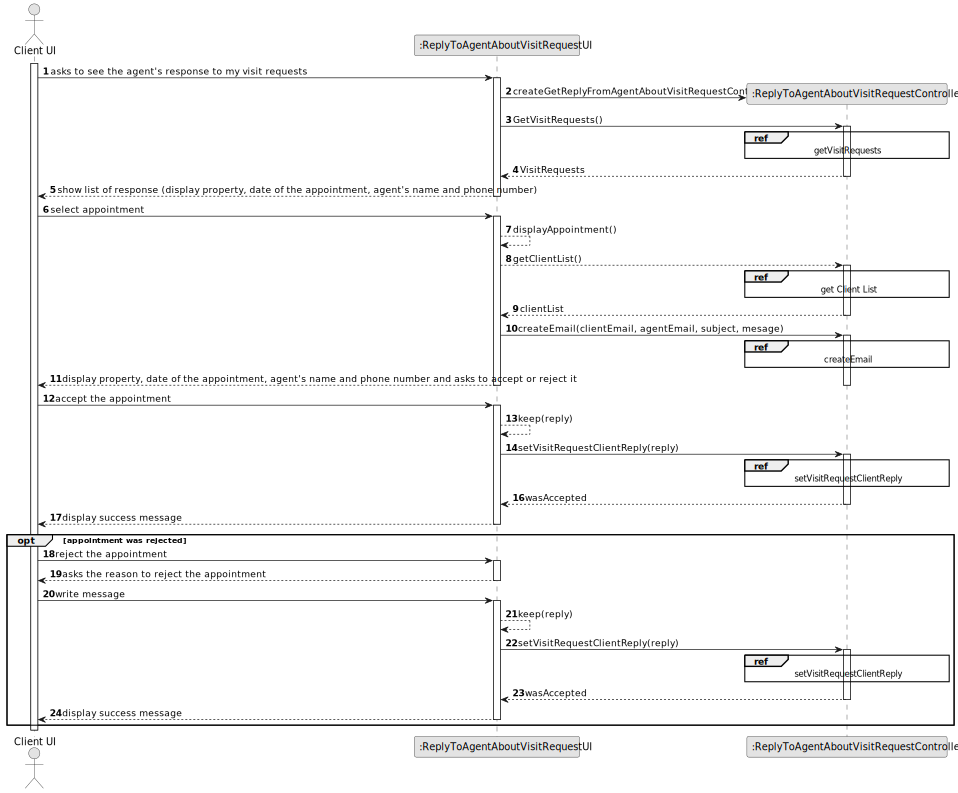
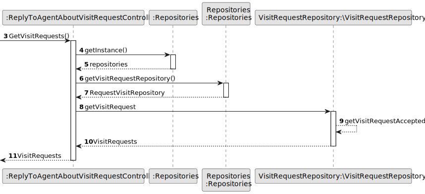
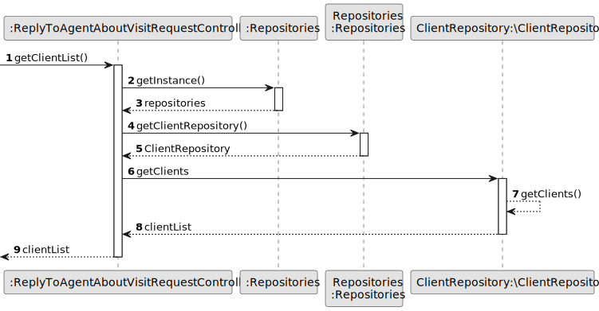
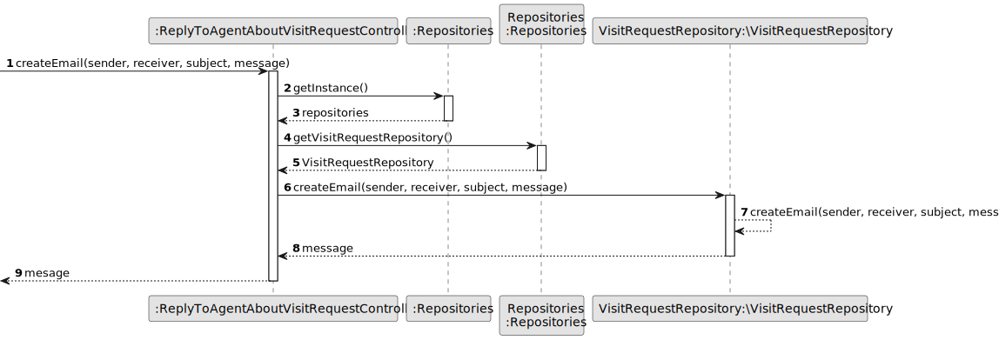
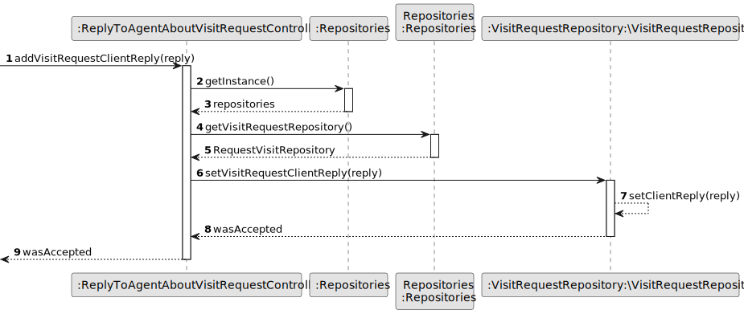
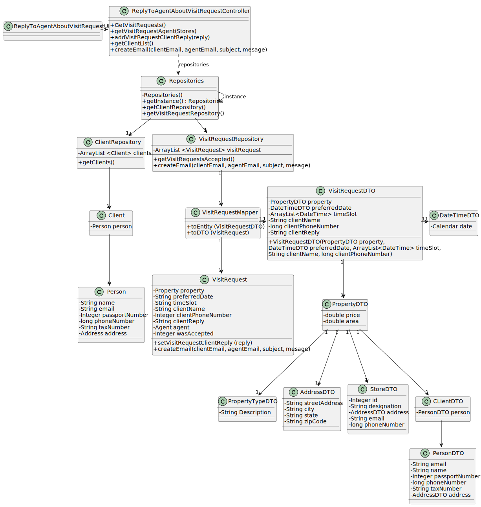

# US 020 - Response to the appointment request

## 3. Design - User Story Realization 

### 3.1. Rationale

**SSD - Display listed properties**

| Interaction ID                                                                                                                                | Question: Which class is responsible for...            | Answer                                        | Justification (with patterns)                                                                                 |
|:----------------------------------------------------------------------------------------------------------------------------------------------|:-------------------------------------------------------|:----------------------------------------------|:--------------------------------------------------------------------------------------------------------------|
| Step 1 - asks to see the agent's response to my visit requests                                                                                | 	... interacting with the actor?                       | ReplyToAgentAboutVisitRequestUI          | Pure Fabrication: there is no reason to assign this responsibility to any existing class in the Domain Model. |
| 			  		                                                                                                                                       | 	... coordinating the US?                              | ReplyToAgentAboutVisitRequestController  | Controller                                                                                                    |
| Step 2 - show list of response (display property, date of the appointment, agent's name and phone number)                                    | 		... knowing the visit requests to show?	  	          | VisitRequestRepository                        | Repository                                                                                                    |
|                                                                                                                                               | 		... knowing the visit requests's agent to show?	  	  | EmployeeRepository                            | Repository                                                                                                    |
| Step 3 - select appointment  		                                                                                                               | 	...saving the choosen appointment?                    | ReplyToAgentAboutVisitRequestUI          | Pure Fabrication                                                                                              |
| Step 4 - displays agent's response (display property, date of the appointment, agent's name and phone number) and asks to accept or reject it | 		... knowing the appointment information tp show?	  	 | ReplyToAgentAboutVisitRequestUI          | Pure Fabrication                                                                                              |
| Step 5 - accept the appointment	                                                                                                              | 	...saving the client reply?                           | ReplyToAgentAboutVisitRequestUI          | Pure Fabrication                                                                                              |
|                                                                                                                                               | 	...validate the reply to the visit request?           | ReplyToAgentAboutVisitRequestUI          | Fabrication                                                                                                   |
|                                                                                                                                               | 	...adding the reply to the visit request?             | VisitRequestRepository                        | Repository                                                                                                    | 
| 			  		                                                                                                                                       | 	... validating the visit request?                     | VisitRequestRepository                        | The VisitRequestRepository owns its data.                                                                     |
| Step 6 - show success message                                                                                                                 | ... informing operation success?                       | ReplyToAgentAboutVisitRequestUI          | It is responsible for user interactions.                                                                      |

### Systematization ##

According to the taken rationale, the conceptual classes promoted to software classes are:

 * VisitRequestRepository 
 * EmployeeRepository

Other software classes (i.e. Pure Fabrication) identified:
 * ReplyToAgentAboutVisitRequestUI
 * ReplyToAgentAboutVisitRequestController

## 3.2. Sequence Diagram (SD)

### Alternative 1 - Full Diagram

This diagram shows the full sequence of interactions between the classes involved in the realization of this user story.

### Alternative 2 - Split Diagram

This diagram shows the same sequence of interactions between the classes involved in the realization of this user story, but it is split in partial diagrams to better illustrate the interactions between the classes.

It uses interaction ocurrence.

**Get Visit Request List**

**Get Client List**

**Create Email**

**Set Visit Request Client Reply**

## 3.3. Class Diagram (CD)

